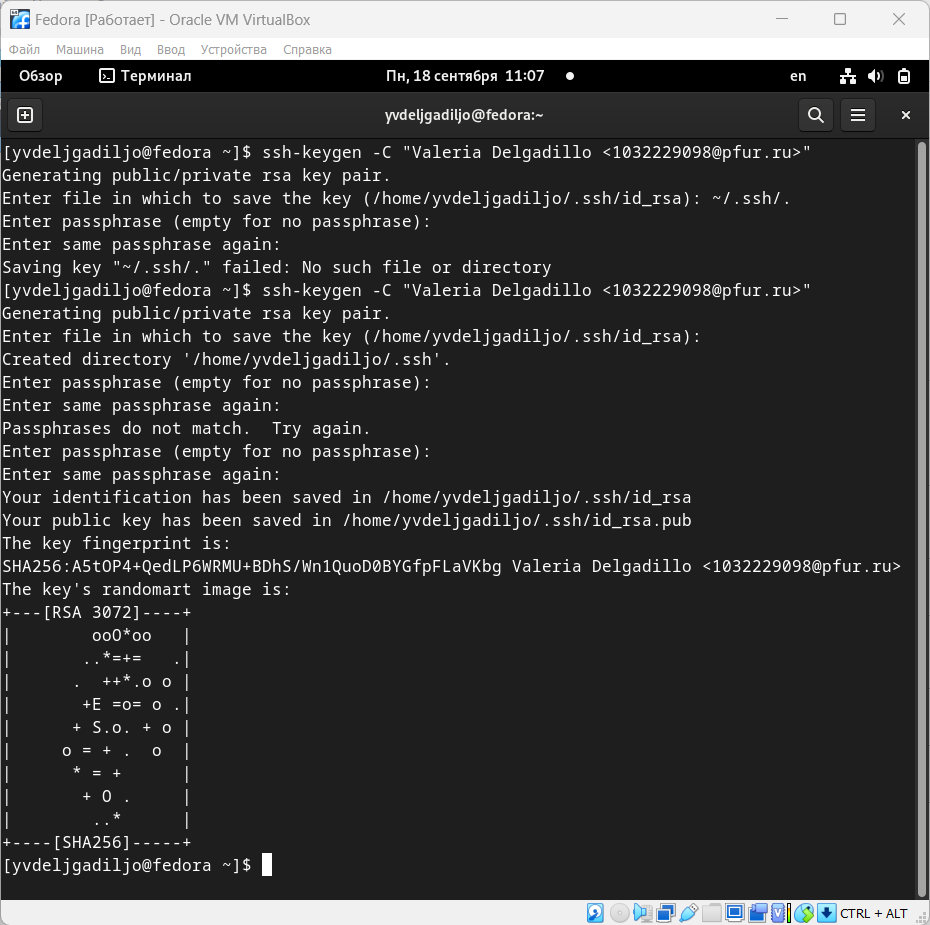

---
## Front matter
title: "Шаблон отчёта по лабораторной работе"
subtitle: "Простейший вариант"
author: "Дельгадильо Валерия"

## Generic otions
lang: ru-RU
toc-title: "Содержание"

## Bibliography
bibliography: bib/cite.bib
csl: pandoc/csl/gost-r-7-0-5-2008-numeric.csl

## Pdf output format
toc: true # Table of contents
toc-depth: 2
lof: true # List of figures
lot: true # List of tables
fontsize: 12pt
linestretch: 1.5
papersize: a4
documentclass: scrreprt
## I18n polyglossia
polyglossia-lang:
  name: russian
  options:
	- spelling=modern
	- babelshorthands=true
polyglossia-otherlangs:
  name: english
## I18n babel
babel-lang: russian
babel-otherlangs: english
## Fonts
mainfont: PT Serif
romanfont: PT Serif
sansfont: PT Sans
monofont: PT Mono
mainfontoptions: Ligatures=TeX
romanfontoptions: Ligatures=TeX
sansfontoptions: Ligatures=TeX,Scale=MatchLowercase
monofontoptions: Scale=MatchLowercase,Scale=0.9
## Biblatex
biblatex: true
biblio-style: "gost-numeric"
biblatexoptions:
  - parentracker=true
  - backend=biber
  - hyperref=auto
  - language=auto
  - autolang=other*
  - citestyle=gost-numeric
## Pandoc-crossref LaTeX customization
figureTitle: "Рис."
tableTitle: "Таблица"
listingTitle: "Листинг"
lofTitle: "Список иллюстраций"
lotTitle: "Список таблиц"
lolTitle: "Листинги"
## Misc options
indent: true
header-includes:
  - \usepackage{indentfirst}
  - \usepackage{float} # keep figures where there are in the text
  - \floatplacement{figure}{H} # keep figures where there are in the text
---
# Цель работы 

> Целью работы является изучить идеологию и применение средств контроля
> версий. Приобрести практические навыки по работе с системой git.

#  Теоретическое введение

## Системы контроля версий. Общие понятия

> Системы контроля версий (Version Control System, VCS) применяются при
> работе нескольких человек над одним проектом. Обычно основное дерево
> проекта хранится в локальном или удалённом репозитории, к которому
> настроен доступ для участников проекта. При внесении изменений в
> содержание проекта система контроля версий позволяет их фиксировать,
> совмещать изменения, произведённые разными участниками проекта,
> производить откат к любой более ранней версии проекта, если это
> требуется.

## Система контроля версий Git

> Система контроля версий Git представляет собой набор программ
> командной строки. Доступ к ним можно получить из терминала посредством
> ввода команды git с различными опциями.

## Основные команды git

> Наиболее часто используемые команды git представлены в таблице 1

[]{#Tab:01}Таблица 1 Основные команды git

+------------------+---------------------------------------------------+
| Команда          | Описание                                          |
+==================+===================================================+
| git init         | создание основного дерева репозитория             |
+------------------+---------------------------------------------------+
| git pull         | получение обновлений (изменений) текущего дерева  |
|                  | из центрального репозитория                       |
+------------------+---------------------------------------------------+
| git push         | отправка всех произведённых изменений локального  |
|                  | дерева в центральный репозиторий                  |
+------------------+---------------------------------------------------+
| git status       | просмотр списка изменённых файлов в текущей       |
|                  | директории                                        |
+------------------+---------------------------------------------------+
| git diff         | просмотр текущих изменения                        |
+------------------+---------------------------------------------------+
| git add          | добавить все изменённые и/или созданные файлы     |
|                  | и/или каталоги                                    |
+------------------+---------------------------------------------------+
| git add          | добавить конкретные изменённые и/или созданные    |
|                  | файлы и/или каталоги                              |
| имена_фаилов     |                                                   |
+------------------+---------------------------------------------------+
| git rm           | удалить файл и/или каталог из индекса репозитория |
|                  | (при этом файл и/или каталог остаётся в локальной |
| имена_фаилов     | директории)                                       |
+------------------+---------------------------------------------------+
| git commit -am   | сохранить все добавленные изменения и все         |
| \'Описание       | изменённые файлы                                  |
| коммита\'        |                                                   |
+------------------+---------------------------------------------------+
| git checkout -b  | создание новой ветки, базирующейся на текущей     |
| имя_ветки        |                                                   |
+------------------+---------------------------------------------------+
| git checkout     | переключение на некоторую ветку (при переключении |
| имя_ветки        | на ветку, которой ещё нет в локальном             |
|                  | репозитории, она будет создана и связана с        |
|                  | удалённой)                                        |
+------------------+---------------------------------------------------+
| git push origin  | отправка изменений конкретной ветки в центральный |
| имя_ветки        | репозиторий                                       |
+------------------+---------------------------------------------------+
| git merge        | слияние ветки с текущим деревом                   |
| \--no-ff         |                                                   |
|                  |                                                   |
| имя_ветки        |                                                   |
+------------------+---------------------------------------------------+
| git branch -d    | удаление локальной уже слитой с основным деревом  |
| имя_ветки        | ветки                                             |
+------------------+---------------------------------------------------+
| git branch -D    | принудительное удаление локальной ветки           |
| имя_ветки        |                                                   |
+------------------+---------------------------------------------------+
| git push origin  | удаление ветки с центрального репозитория         |
| :имя_ветки       |                                                   |
+------------------+---------------------------------------------------+

# Лабораторной работы 

## Настройка github

> Для выполнения лабораторных работ предлагается использовать Github.
> Создайте учётную запись на сайте https://github.com/ и заполните
> основные данные.
>
> Созданная учетная запись показана на рисунках [-@fig:3.1] и [-@fig:3.2].
>
> { #fig:3.1 width="6.259in"
> height="3.177in"}
>
> {#fig:3.2 width="6.259in"
> height="3.177in"}

## Базовая настройка git

> Сначала сделаем предварительную конфигурацию git.

a)  Откройте терминал и введите следующие команды, указав имя и email
    владельца репозитория:

> {#fig:3.3 width=100%}

b)  Настроим utf-8 в выводе сообщений git и зададим имя начальной ветки
    (будем называть её master):

> {#fig:3.4 width=100%}

c)  Параметр autocrlf и параметр safecrlf:

> {#fig:3.5 width=100%}

## Создание SSH ключа

> Для последующей идентификации пользователя на сервере репозиториев
> необходимо сгенерировать пару ключей (приватный и открытый).
>
> {#fig:3.6 width="6.259in"
> height="6.226in"}

>
> Далее необходимо загрузить сгенерённый открытый ключ. Для этого зайти
> на сайт http://github.org/ под своей учётной записью и перейти в меню
> *Setting* . После этого выбрать в боковом меню *SSH and GPG* keys и
> нажать кнопку *New SSH key*. Скопировав из локальной консоли ключ в
> буфер обмена.
>
> {#fig:3.7 width="6.259in"
> height="6.226in"}
>
> Вставляем ключ в появившееся на сайте поле и указываем для ключа имя
> (Title).
>
> {#fig:3.8 width="6.25984251968504in"
> height="6.75704615048119in"}

## Сознание рабочего пространства и репозитория курса на основе шаблона

> Название проекта на хостинге git имеет вид: study\_\<учебный
> год\>\_\<код предмета\>. Откройте терминал и создайте каталог для
> предмета «Архитектура компьютера»:
>
> {#fig:3.9 width=100%}

## Сознание репозитория курса на основе шаблона

> Создайте репозиторий на основе шаблона через веб-интерфейс github.
> Репозиторий на основе шаблона можно создать через web-интерфейс
> github. Перейдите на станицу репозитория с шаблоном курса
> https://github.com/yamadharma/cour se-directory-student-template.
> Далее выберите Use this template.
>
> {#fig:3.10 width=100%}

>
> В открывшемся окне задайте имя репозитория (Repository name)
> study_2023--2024_arhpc и создайте репозиторий (кнопка Create
> repository from template).
>
> {#fig:3.11 width=100%}
>
> Откройте терминал и перейдите в каталог курса и клонируйте созданный
> репозиторий.
>
> {#fig:3.12 width="5.669291338582677in"
> height="4.488688757655293in"}

## Настройка каталога курса

> Перейдите в каталог курса и удалите лишние файлы
>
> {#fig:3.13 width="6.259in"
> height="6.259in"}
>
> Создайте необходимые каталоги:
>
> {#fig:3.14 width="6.25984251968504in"
> height="6.259in"}
>
> Отправьте файлы на сервер:
>
> {#fig:3.15 width="5.152896981627297in"
> height="4.4093930446194225in"}
>
> {#fig:3.16 width="5.118110236220472in"
> height="4.386952099737533in"}

# Задание для самостоятельной работы

## Создать лабораторный отчет в каталоге

> {#fig:4.1 width="6.5in"
> height="4.5in"}

## Скопируйте отчеты по выполнению предыдущих лабораторных работ в соответствующие каталоги созданного рабочего пространства.

> {#fig:4.2 width="6.264204943132109in"
> height="3.177in"}

## Загрузите файлы на github

> {#fig:4.3 width="6.25984251968504in"
> height="6.25in"}

#  Выводы

> Благодаря этой лаборатории 2 вы узнали основные задачи, которые решает
> инструмент git и все его команды.

#  Список литературы

-   GDB: The GNU Project Debugger. --- URL:
    https://www.gnu.org/software/gdb/.

-   GNU Bash Manual. --- 2016. --- URL:
    https://www.gnu.org/software/bash/manual/.

-   Midnight Commander Development Center. --- 2021. --- URL:
    https://midnight-commander.org/.

-   NASM Assembly Language Tutorials. --- 2021. --- URL:
    https://asmtutor.com/.

-   *Newham* *C.* Learning the bash Shell: Unix Shell Programming. ---
    O'Reilly Media, 2005. ---354 с. --- (In a Nutshell). ---
    ISBN 0596009658. --- URL:
    http://www.amazon.com/Learningbash-Shell-Programming-Nutshell/dp/0596009658.

-   *Robbins A.* Bash Pocket Reference. --- O'Reilly Media, 2016. ---
    156 с. --- ISBN 978-1491941591.

-   The NASM documentation. --- 2021. --- URL:
    https://www.nasm.us/docs.php.

-   *Zarrelli G.* Mastering Bash. --- Packt Publishing, 2017. --- 502 с.
    --- ISBN 9781784396879.

-   *Колдаев В. Д., Лупин С. А.* Архитектура ЭВМ. --- М. : Форум, 2018.

-   *Куляс О. Л., Никитин К. А.* Курс программирования на ASSEMBLER. ---
    М. : Солон-Пресс, 2017.

-   *Новожилов О. П.* Архитектура ЭВМ и систем. --- М. : Юрайт, 2016.

-   Расширенный ассемблер: NASM. --- 2021. --- URL:
    https://www.opennet.ru/docs/RUS/nasm/.

-   *Робачевский А., Немнюгин С., Стесик О.* Операционная система UNIX.
    --- 2-е изд. --- БХВПетербург, 2010. --- 656 с. --- ISBN
    978-5-94157-538-1.

-   *Столяров А.* Программирование на языке ассемблера NASM для ОС Unix.
    --- 2-е изд. --- М. : МАКС Пресс, 2011. --- URL:
    http://www.stolyarov.info/books/asm_unix.

-   *Таненбаум Э.* Архитектура компьютера. --- 6-е изд. --- СПб. :
    Питер, 2013. --- 874 с. --- (Классика Computer Science).

-   *Таненбаум Э., Бос Х.* Современные операционные системы. --- 4-е
    изд. --- СПб. : Питер, 2015. --- 1120 с. --- (Классика Computer
    Science)
