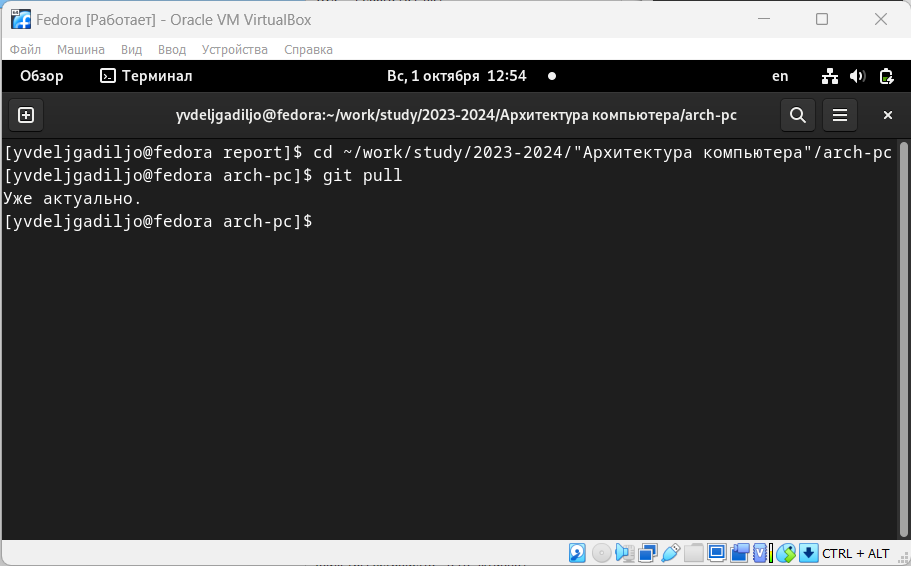
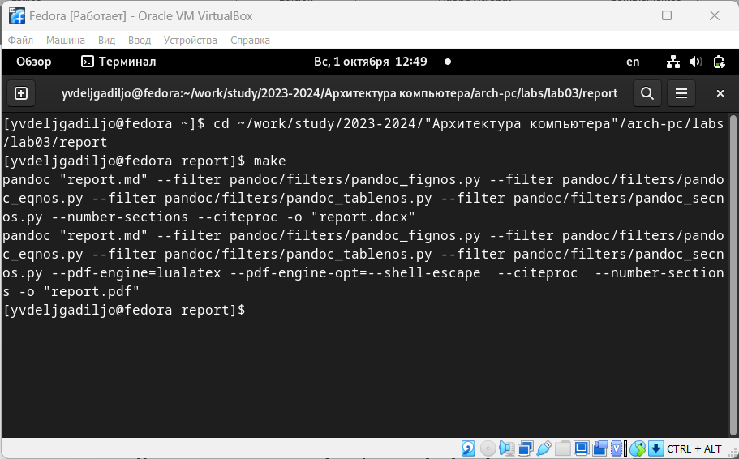
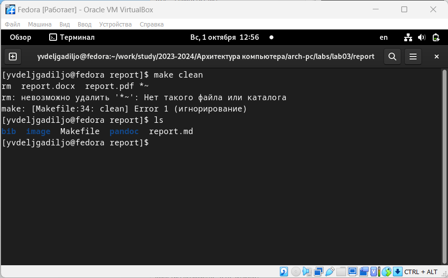
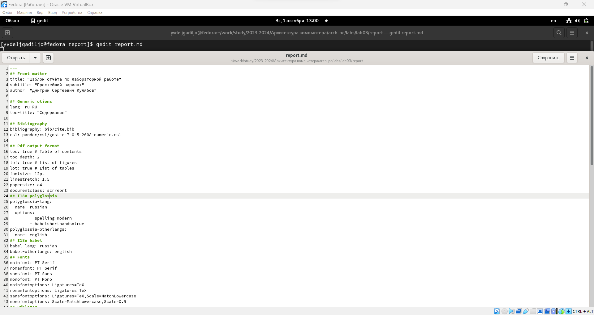
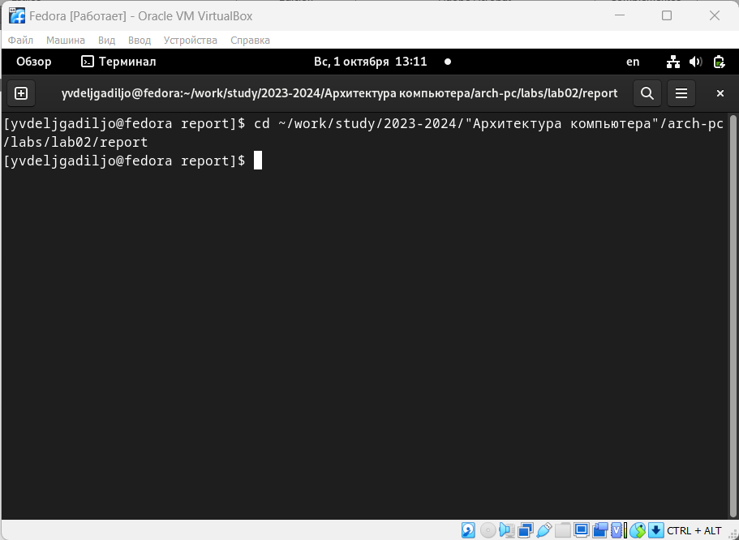
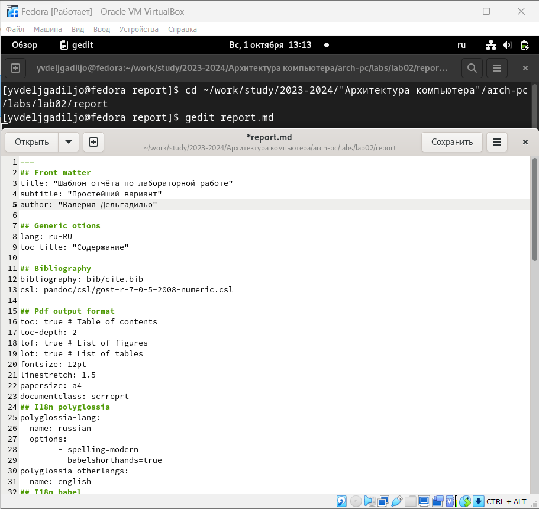
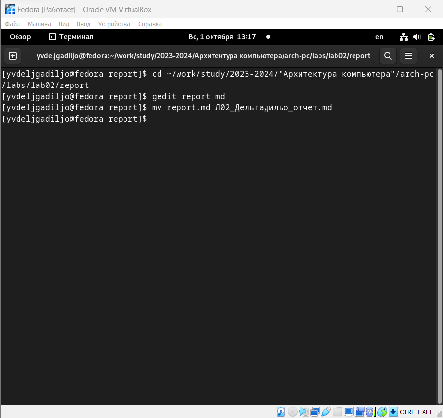
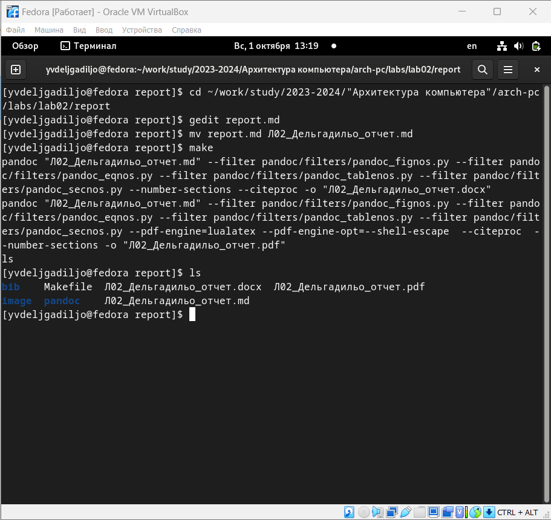
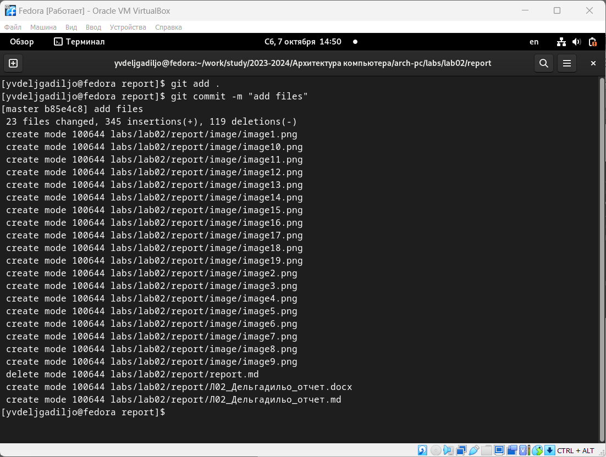
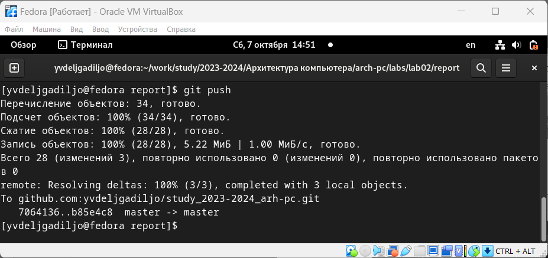

---
## Front matter
title: "Шаблон отчёта по лабораторной работе"
subtitle: "Простейший вариант"
author: "Дельгадильо Валерия"

## Generic otions
lang: ru-RU
toc-title: "Содержание"

## Bibliography
bibliography: bib/cite.bib
csl: pandoc/csl/gost-r-7-0-5-2008-numeric.csl

## Pdf output format
toc: true # Table of contents
toc-depth: 2
lof: true # List of figures
fontsize: 12pt
linestretch: 1.5
papersize: a4
documentclass: scrreprt
## I18n polyglossia
polyglossia-lang:
  name: russian
  options:
	- spelling=modern
	- babelshorthands=true
polyglossia-otherlangs:
  name: english
## I18n babel
babel-lang: russian
babel-otherlangs: english
## Fonts
mainfont: PT Serif
romanfont: PT Serif
sansfont: PT Sans
monofont: PT Mono
mainfontoptions: Ligatures=TeX
romanfontoptions: Ligatures=TeX
sansfontoptions: Ligatures=TeX,Scale=MatchLowercase
monofontoptions: Scale=MatchLowercase,Scale=0.9
## Biblatex
biblatex: true
biblio-style: "gost-numeric"
biblatexoptions:
  - parentracker=true
  - backend=biber
  - hyperref=auto
  - language=auto
  - autolang=other*
  - citestyle=gost-numeric
## Pandoc-crossref LaTeX customization
figureTitle: "Рис."
tableTitle: "Таблица"
listingTitle: "Листинг"
lofTitle: "Список иллюстраций"
lotTitle: "Список таблиц"
lolTitle: "Листинги"
## Misc options
indent: true
header-includes:
  - \usepackage{indentfirst}
  - \usepackage{float} # keep figures where there are in the text
  - \floatplacement{figure}{H} # keep figures where there are in the text
---

# Цель работы 

> Целью работы является освоение процедуры оформления отчетов с помощью
> легковесного языка разметки Markdown.

#  Теоретическое введение

С помощью Markdown вы можете:

-   Создание формул в Markdown

-   Дизайн изображений в Markdown

-   Обрабатывать файлы в формате Markdown

# Лабораторной работы 

> Перейдите в каталог курса сформированный при выполнении лабораторной
> работы №2:
>
> cd \~/work/study/2023-2024/\"Архитектура компьютера\"/arch-pc/
>
> Oбновите локальный репозиторий, скачав изменения из удаленного
> репозитория с помощью команды
>
> git pull
>
> {#fig:3.1 width=100%}
>
> Перейдите в каталог с шаблоном отчета по лабораторной работе № 3
>
> cd \~/work/study/2023-2024/\"Архитектура
> компьютера\"/arch-pc/labs/lab03/report
>
> {#fig:3.2 width=100%}
>
> Pоведите компиляцию шаблона с использованием Makefile. Для этого
> введите команду
>
> make
>
> При успешной компиляции должны сгенерироваться файлы report.pdf и
> report.docx. Откройте и проверьте корректность полученных файлов.
>
> {#fig:3.3 width=100%}
>
> Удалите полученный файлы с использованием Makefile. Для этого введите
> команду
>
> make clean
>
> {#fig:3.4 width=100%}
>
> Проверьте, что после этой команды файлы report.pdf и report.docx были
> удалены.
>
> Откройте файл report.md c помощью любого текстового редактора,
> например gedit
>
> gedit report.md
>
> Внимательно изучите структуру этого файла.
>
> {#fig:3.5 width=100%}
>
> Заполните отчет и скомпилируйте отчет с использованием Makefile.
> Проверьте корректность полученных файлов. (Обратите внимание, для
> корректного отображения скриншотов они должны быть размещены в
> каталоге image)

> Загрузите файлы на Github.cd \~/work/study/2023-2024/\"Архитектура
> компьютера\"/arch-pc

# Задание для самостоятельной работы

> Перехожу в каталог с отчетом по третьей лабораторной работе.
>
> {#fig:4.1 width=100%}

>Открыла файл с шаблоном отчета и заполнила его.

> {#fig:4.2 width=100%}

> Переименовала файл, в котором заполняла.
>{#fig:4.3 width=100%}

>Компилирую отчет и проверяю, что были созданы файлы.

>{#fig:4.4 width=100%}

>Загружаю файлы на GitHub.

>{#fig:4.5 width=100%}

> {#fig:4.6 width=100%}

#  Выводы

> Благодаря лаборатории 3 вы узнали о Markdown. Определять дизайн
> шрифтов, составлять списки, создавать изображения, ссылки,
> математические формулы и ссылки на них в Markdown.

#  Список литературы

-   GDB: The GNU Project Debugger. --- URL:
    https://www.gnu.org/software/gdb/.

-   GNU Bash Manual. --- 2016. --- URL:
    https://www.gnu.org/software/bash/manual/.

-   Midnight Commander Development Center. --- 2021. --- URL:
    https://midnight-commander.org/.

-   NASM Assembly Language Tutorials. --- 2021. --- URL:
    https://asmtutor.com/.

-   Newham C. Learning the bash Shell: Unix Shell Programming. ---
    O'Reilly Media, 2005. ---354 с. --- (In a Nutshell). ---
    ISBN 0596009658. --- URL:
    http://www.amazon.com/Learningbash-Shell-Programming-Nutshell/dp/0596009658.

-   Robbins A. Bash Pocket Reference. --- O'Reilly Media, 2016. --- 156
    с. --- ISBN 978-1491941591.

-   The NASM documentation. --- 2021. --- URL:
    https://www.nasm.us/docs.php.

-   Zarrelli G. Mastering Bash. --- Packt Publishing, 2017. --- 502 с.
    --- ISBN 9781784396879.

-   Колдаев В. Д., Лупин С. А. Архитектура ЭВМ. --- М. : Форум, 2018.

-   Куляс О. Л., Никитин К. А. Курс программирования на ASSEMBLER. ---
    М. : Солон-Пресс, 2017.

-   Новожилов О. П. Архитектура ЭВМ и систем. --- М. : Юрайт, 2016.

-   Расширенный ассемблер: NASM. --- 2021. --- URL:
    https://www.opennet.ru/docs/RUS/nasm/.

-   Робачевский А., Немнюгин С., Стесик О. Операционная система UNIX.
    --- 2-е изд. --- БХВПетербург, 2010. --- 656 с. --- ISBN
    978-5-94157-538-1.

-   Столяров А. Программирование на языке ассемблера NASM для ОС Unix.
    --- 2-е изд. --- М. : МАКС Пресс, 2011. --- URL:
    http://www.stolyarov.info/books/asm_unix.

-   Таненбаум Э. Архитектура компьютера. --- 6-е изд. --- СПб. :
    Питер, 2013. --- 874 с. --- (Классика Computer Science).

-   Таненбаум Э., Бос Х. Современные операционные системы. --- 4-е изд.
    --- СПб. : Питер, 2015. --- 1120 с. --- (Классика Computer Science).
