---
## Front matter
title: "Отчет по лабораторной работе №4"
subtitle: "Дисциплина: архитектура компьютера"
author: "Дельгадильо Валерия"

## Generic otions
lang: ru-RU
toc-title: "Содержание"

## Bibliography
bibliography: bib/cite.bib
csl: pandoc/csl/gost-r-7-0-5-2008-numeric.csl

## Pdf output format
toc: true # Table of contents
toc-depth: 2
lof: true # List of figures
lot: true # List of tables
fontsize: 12pt
linestretch: 1.5
papersize: a4
documentclass: scrreprt
## I18n polyglossia
polyglossia-lang:
  name: russian
  options:
	- spelling=modern
	- babelshorthands=true
polyglossia-otherlangs:
  name: english
## I18n babel
babel-lang: russian
babel-otherlangs: english
## Fonts
mainfont: PT Serif
romanfont: PT Serif
sansfont: PT Sans
monofont: PT Mono
mainfontoptions: Ligatures=TeX
romanfontoptions: Ligatures=TeX
sansfontoptions: Ligatures=TeX,Scale=MatchLowercase
monofontoptions: Scale=MatchLowercase,Scale=0.9
## Biblatex
biblatex: true
biblio-style: "gost-numeric"
biblatexoptions:
  - parentracker=true
  - backend=biber
  - hyperref=auto
  - language=auto
  - autolang=other*
  - citestyle=gost-numeric
## Pandoc-crossref LaTeX customization
figureTitle: "Рис."
tableTitle: "Таблица"
listingTitle: "Листинг"
lofTitle: "Список иллюстраций"
lotTitle: "Список таблиц"
lolTitle: "Листинги"
## Misc options
indent: true
header-includes:
  - \usepackage{indentfirst}
  - \usepackage{float} # keep figures where there are in the text
  - \floatplacement{figure}{H} # keep figures where there are in the text
---
# Цель работы 

> Освоение процедуры компиляции и сборки программ, написанных на
> ассемблере NASM.

# Теоретическое введение

## Основные принципы работы компьютера

> Основными функциональными элементами любой электронно-вычислительной машины (ЭВМ) являются центральный процессор, память и периферийные устройства.
>
> Взаимодействие этих устройств осуществляется через общую шину, к которой они подключены. Физически шина представляет собой большое количество проводников, соединяющих устройства друг с другом. В современных компьютерах проводники выполнены в виде электропроводящих дорожек на материнской (системной) плате.

## Ассемблер и язык ассемблера

> Язык ассемблера (assembly language, сокращённо asm) ---
> машинно-ориентированный язык низкого уровня. Можно считать, что он
> больше любых других языков приближен к архитектуре ЭВМ и её аппаратным
> возможностям, что позволяет получить к ним более полный доступ, нежели
> в языках высокого уровня,таких как C/C++, Perl, Python и пр. Заметим,
> что получить полный доступ к ресурсам компьютера в современных
> архитектурах нельзя, самым низким уровнем работы прикладной программы
> является обращение напрямую к ядру операционной системы. Именно на
> этом уровне и работают программы, написанные на ассемблере. Но в
> отличие от языков высокого уровня ассемблерная программа содержит
> только тот код, который ввёл программист. Таким образом язык
> ассемблера --- это язык, с помощью которого понятным для человека
> образом пишутся команды для процессора.

# Лабораторной работы 

## Программа Hello world!

> Создайте каталог для работы с программами на языке ассемблера NASM:
>
> mkdir -p \~/work/arch-pc/lab04
>
> 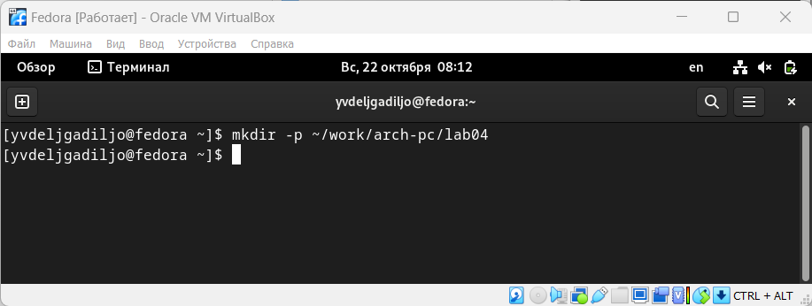{#fig:3.1 width=90%}
>
> Перейдите в созданный каталог
>
> cd \~/work/arch-pc/lab04
>
> 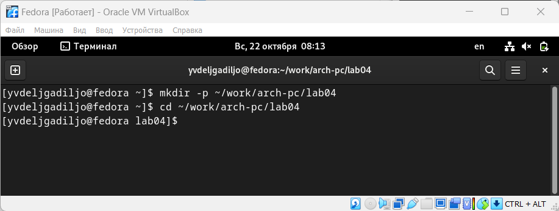{#fig:3.2 width=90%}

> Создайте текстовый файл с именем hello.asm
>
> touch hello.asm
>
> 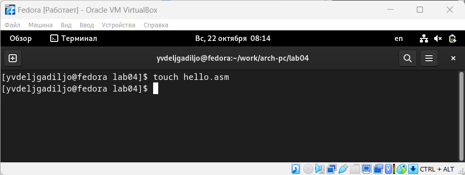{#fig:3.3 width=90%}
>
> откройте этот файл с помощью любого текстового редактора, например,
> gedit
>
> gedit hello.asm
>
> 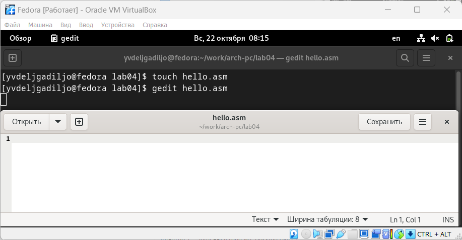{#fig:3.4 width=90%}

> и введите в него следующий текст:

> 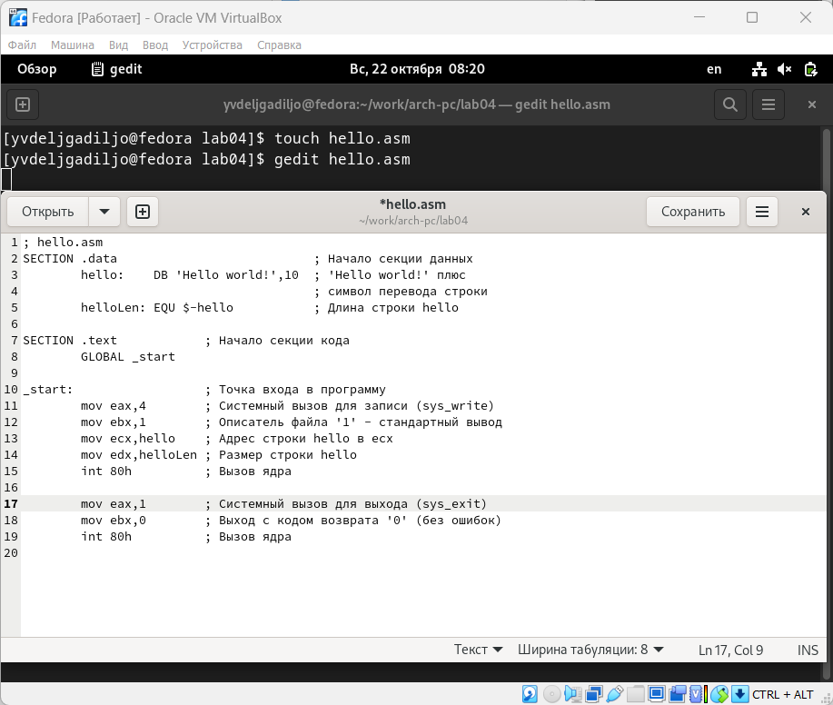{#fig:3.5 width=90%}

> - В отличие от многих современных высокоуровневых языков
    программирования, в ассемблерной программе каждая команда
    располагается на отдельной строке. Размещение нескольких команд на
    одной строке недопустимо. Синтаксис ассемблера NASM является
    чувствительным к регистру, т.е. есть разница между большими и малыми
    буквами.

## Транслятор NASM

> NASM превращает текст программы в объектный код. Для компиляции
> приведённого выше текста программы «Hello World» необходимо написать:

> nasm -f elf hello.asm

> 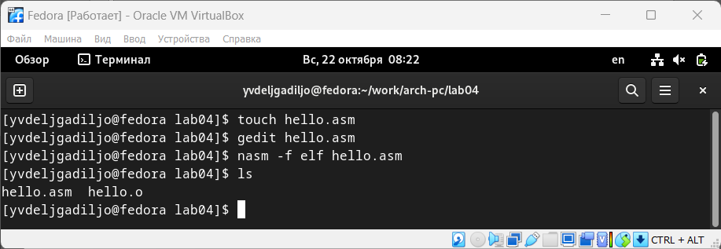{#fig:3.6 width=90%}

> Текст программы набран без ошибок

## Расширенный синтаксис командной строки NASM

> Выполните следующую команду:

> nasm -o obj.o -f elf -g -l list.lst hello.asm

> 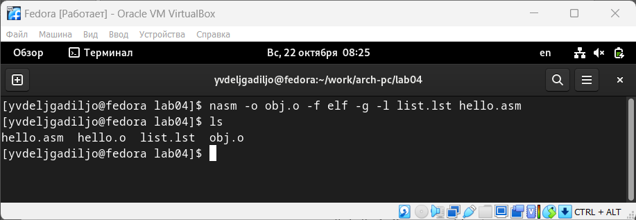{#fig:3.7 width=90%}

> Данная команда скомпилирует исходный файл hello.asm в obj.o (опция -o
> позволяет задать имя объектного файла, в данном случае obj.o), при
> этом формат выходного файла будет elf, и в него будут включены символы
> для отладки (опция -g), кроме того, будет создан файл листинга
> list.lst (опция -l).
>
> С помощью команды ls проверяю, что файлы были созданы.

## Компоновщик LD

> Oбъектный файл необходимо передать на обработку компоновщику:

> ld -m elf_i386 hello.o -o hello

> 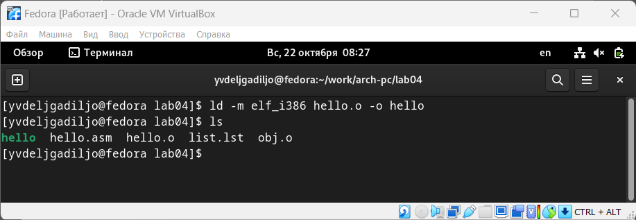{#fig:3.8 width=90%}

> С помощью команды ls проверяю, что исполняемый файл hello был создан.
>
> Ключ -o с последующим значением задаёт в данном случае имя
> создаваемого исполняемого файла.
>
> Выполните следующую команду:
>
> ld -m elf_i386 obj.o -o main
>
> 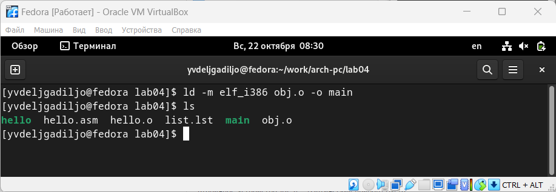{#fig:3.9 width=90%}

> Запустить на выполнение созданный исполняемый файл, находящийся в
> текущем каталоге, можно, набрав в командной строке: ./hello
>
> 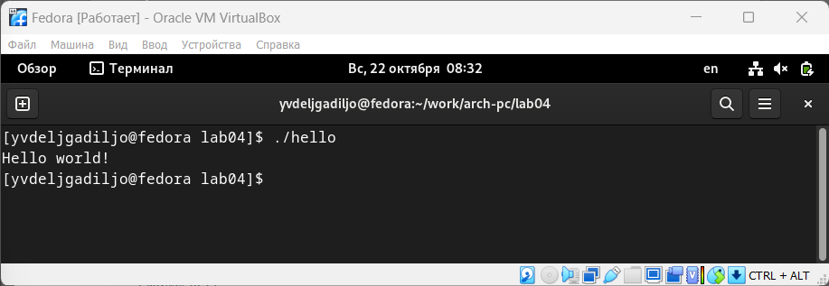{#fig:3.10 width=90%}

# Задание для самостоятельной работы

> В каталоге \~/work/arch-pc/lab04 с помощью команды cp создайте копию
> файла
>
> hello.asm с именем lab4.asm
>
> 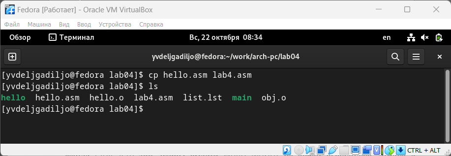{#fig:4.1 width=90%}
>
> С помощью любого текстового редактора внесите изменения в текст
> программы в файле lab4.asm так, чтобы вместо Hello world! на экран
> выводилась строка с вашими фамилией и именем
>
> 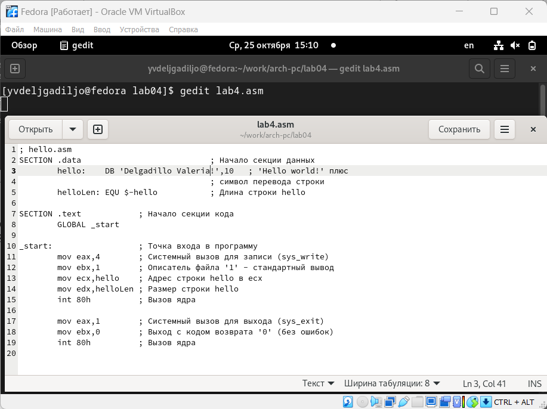{#fig:4.2 width=90%}
>
> Оттранслируйте полученный текст программы lab4.asm в объектный файл.
>
> 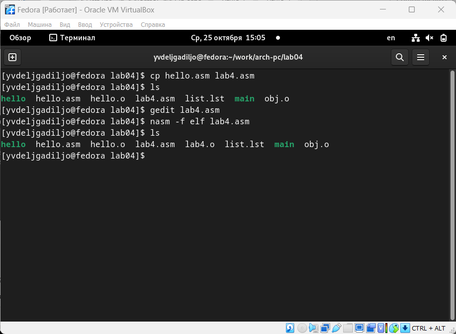{#fig:4.3 width=90%}

> Выполните компоновку объектного файла и запустите получившийся
> исполняемый файл.

> 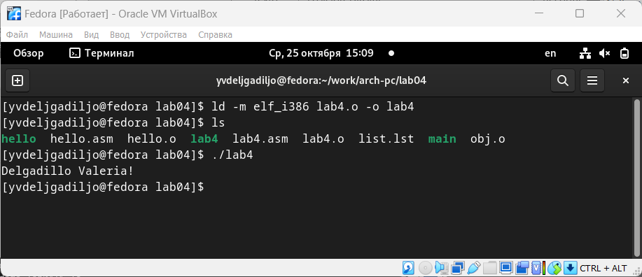{#fig:4.4 width=90%}

> Скопируйте файлы hello.asm и lab4.asm в Ваш локальный репозиторий в
> каталог \~/work/study/2023-2024/\"Архитектура
> компьютера\"/arch-pc/labs/lab04/.

> 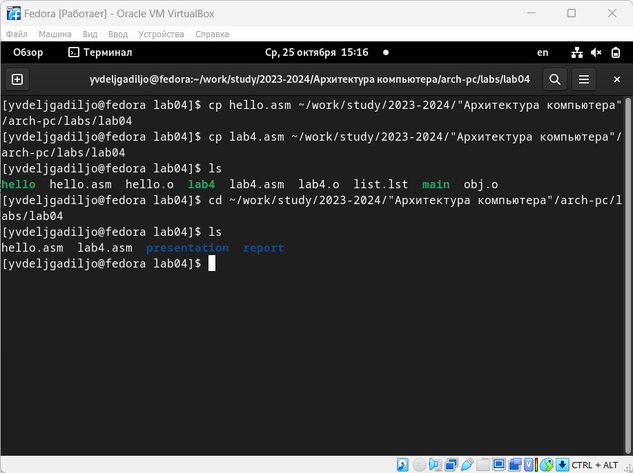{#fig:4.5 width=90%}

> Загрузите файлы на Github.

> 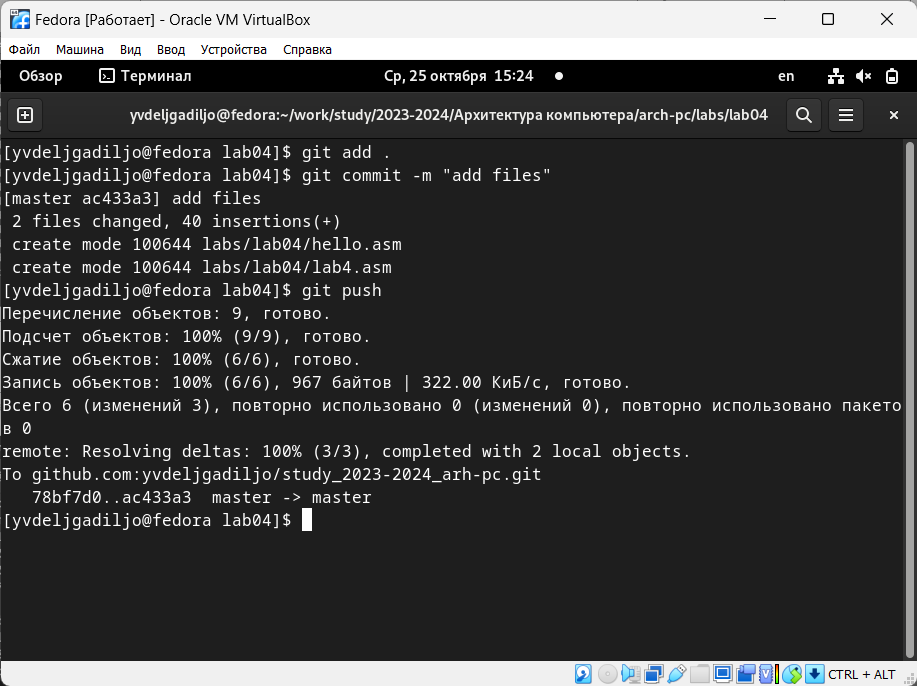{#fig:4.6 width=90%}

#  Выводы

> В ходе данной лбораторной работы я освоила процедуры компиляции и
> сборки программ, написанных на ассемблере NASM.\

# Список литературы

-   GDB: The GNU Project Debugger. --- URL:
    https://www.gnu.org/software/gdb/.

-   GNU Bash Manual. --- 2016. --- URL:
    https://www.gnu.org/software/bash/manual/.

-   Midnight Commander Development Center. --- 2021. --- URL:
    https://midnight-commander.org/.

-   NASM Assembly Language Tutorials. --- 2021. --- URL:
    https://asmtutor.com/.

-   Newham C. Learning the bash Shell: Unix Shell Programming. ---
    O'Reilly Media, 2005. --- 354 с. --- (In a Nutshell). ---
    ISBN 0596009658. --- URL:
    http://www.amazon.com/Learningbash-Shell-Programming-Nutshell/dp/0596009658.

-   Robbins A. Bash Pocket Reference. --- O'Reilly Media, 2016. --- 156
    с. --- ISBN 978-1491941591.

-   The NASM documentation. --- 2021. --- URL:
    https://www.nasm.us/docs.php.

-   Zarrelli G. Mastering Bash. --- Packt Publishing, 2017. --- 502 с.
    --- ISBN 9781784396879.

-   Колдаев В. Д., Лупин С. А. Архитектура ЭВМ. --- М. : Форум, 2018.

-   Куляс О. Л., Никитин К. А. Курс программирования на ASSEMBLER. ---
    М. : Солон-Пресс, 2017.

-   Новожилов О. П. Архитектура ЭВМ и систем. --- М. : Юрайт, 2016.

-   Расширенный ассемблер: NASM. --- 2021. --- URL:
    https://www.opennet.ru/docs/RUS/nasm/.

-   Робачевский А., Немнюгин С., Стесик О. Операционная система UNIX.
    --- 2-е изд. --- БХВПетербург, 2010. --- 656 с. --- ISBN
    978-5-94157-538-1.

-   Столяров А. Программирование на языке ассемблера NASM для ОС Unix.
    --- 2-е изд. --- М. : МАКС Пресс, 2011. --- URL:
    http://www.stolyarov.info/books/asm_unix.

-   Таненбаум Э. Архитектура компьютера. --- 6-е изд. --- СПб. :
    Питер, 2013. --- 874 с. --- (Классика Computer Science).

-   Таненбаум Э., Бос Х. Современные операционные системы. --- 4-е изд.
    --- СПб. : Питер, 2015. --- 1120 с. --- (Классика Computer Science).
