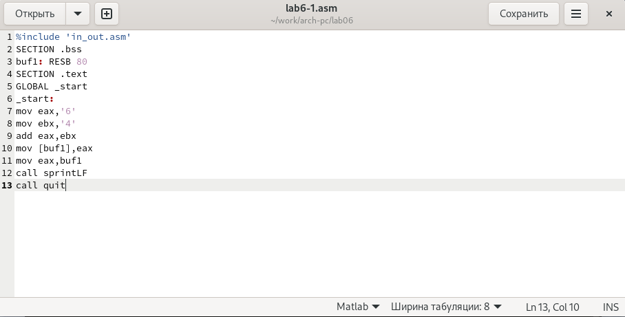
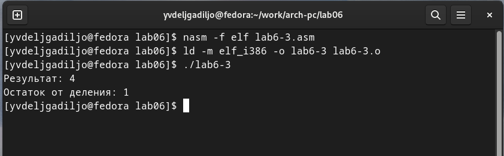
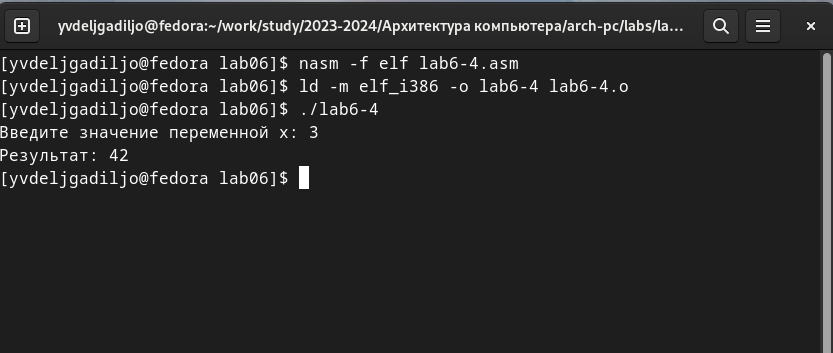

---
## Front matter
title: "Отчет по лабораторной работе №6"
subtitle: "Дисциплина: архитектура компьютера"
author: "Дельгадильо Валерия"

## Generic otions
lang: ru-RU
toc-title: "Содержание"

## Bibliography
bibliography: bib/cite.bib
csl: pandoc/csl/gost-r-7-0-5-2008-numeric.csl

## Pdf output format
toc: true # Table of contents
toc-depth: 2
lof: true # List of figures
lot: true # List of tables
fontsize: 12pt
linestretch: 1.5
papersize: a4
documentclass: scrreprt
## I18n polyglossia
polyglossia-lang:
  name: russian
  options:
	- spelling=modern
	- babelshorthands=true
polyglossia-otherlangs:
  name: english
## I18n babel
babel-lang: russian
babel-otherlangs: english
## Fonts
mainfont: PT Serif
romanfont: PT Serif
sansfont: PT Sans
monofont: PT Mono
mainfontoptions: Ligatures=TeX
romanfontoptions: Ligatures=TeX
sansfontoptions: Ligatures=TeX,Scale=MatchLowercase
monofontoptions: Scale=MatchLowercase,Scale=0.9
## Biblatex
biblatex: true
biblio-style: "gost-numeric"
biblatexoptions:
  - parentracker=true
  - backend=biber
  - hyperref=auto
  - language=auto
  - autolang=other*
  - citestyle=gost-numeric
## Pandoc-crossref LaTeX customization
figureTitle: "Рис."
tableTitle: "Таблица"
listingTitle: "Листинг"
lofTitle: "Список иллюстраций"
lotTitle: "Список таблиц"
lolTitle: "Листинги"
## Misc options
indent: true
header-includes:
  - \usepackage{indentfirst}
  - \usepackage{float} # keep figures where there are in the text
  - \floatplacement{figure}{H} # keep figures where there are in the text
---

# Цель работы 

> Освоение арифметических инструкций языка ассемблера NASM.

#  Теоретическое введение

## Адресация в NASM

> Большинство инструкций на языке ассемблера требуют обработки
> операндов. Адрес операнда предоставляет место, где хранятся данные,
> подлежащие обработке. Это могут быть данные хранящиеся в регистре или
> в ячейке памяти. Далее рассмотрены все существующие способы задания
> адреса хранения операндов -- способы адресации.
>
> Существует три основных способа адресации:
>
> • Регистровая адресация -- операнды хранятся в регистрах и в команде
> используются имена этих регистров, например: mov ax,bx.
>
> • Непосредственная адресация -- значение операнда задается
> непосредственно в команде, Например: mov ax,2.
>
> • Адресация памяти -- операнд задает адрес в памяти. В команде
> указывается символическое обозначение ячейки памяти, над содержимым
> которой требуется выполнить операцию.

## Перевод символа числа в десятичную символьную запись

> Ввод информации с клавиатуры и вывод её на экран осуществляется в
> символьном виде. Кодирование этой информации производится согласно
> кодовой таблице символов ASCII. ASCII -- сокращение от American
> Standard Code for Information Interchange (Американский стандартный
> код для обмена информацией). Согласно стандарту ASCII каждый символ
> кодируется одним байтом.
>
> Расширенная таблица ASCII состоит из двух частей. Первая (символы с
> кодами 0-127) является универсальной (см. Приложение.), а вторая (коды
> 128-255) предназначена для специальных символов и букв национальных
> алфавитов и на компьютерах разных типов может меняться.
>
> Среди инструкций NASM нет такой, которая выводит числа (не в
> символьном виде). Поэтому, например, чтобы вывести число, надо
> предварительно преобразовать его цифры в ASCII-коды этих цифр и
> выводить на экран эти коды, а не само число. Если же выводить число на
> экран непосредственно, то экран воспримет его не как число, а как
> последовательность ASCII-символов -- каждый байт числа будет воспринят
> как один ASCII-символ -- и выведет на экран эти символы.
>
> Аналогичная ситуация происходит и при вводе данных с клавиатуры.
> Введенные данные будут представлять собой символы, что сделает
> невозможным получение корректного результата при выполнении над ними
> арифметических операций.
>
> Для решения этой проблемы необходимо проводить преобразование ASCII
> символов в числа и обратно.).

# Лабораторной работы 

## Символьные и численные данные в NASM

С помощью утилиты mkdir создаю директорию, в которой буду создавать
файлы с программами для лабораторной работы №6. Перехожу в созданный
каталог с помощью утилиты cd. С помощью утилиты touch создаю файл
lab6-1.asm.

{#fig:3.1 width=90%}

Копирую в текущий каталог файл in_out.asm с помощью утилиты cp, т.к. он
будет использоваться в других программах.

{#fig:3.2 width=90%}

Открываю созданный файл lab6-1.asm, вставляю в него программу вывода
значения регистра
eax.

{#fig:3.3 width=90%}

Создаю исполняемый файл программы и запускаю его. Вывод программы:
символ j, потому что программа вывела символ, соответствующий по системе
ASCII сумме двоичных кодов символов 4 и 6.

{#fig:3.4 width=90%}

Изменяю в тексте программы символы "6" и "4" на цифры 6 и 4.

{#fig:3.5 width=90%}

Создаю новый исполняемый файл программы и запускаю его. Теперь вывелся
символ с кодом 10, это символ перевода строки, этот символ не
отображается при выводе на
экран.

{#fig:3.6 width=90%}

Создайте исполняемый файл и запустите его.

Как и в предыдущем случае при исполнении программы мы не получим число
10 . В данном случае выводится символ с кодом 10. Используя таблицу
ASCII, коду 10 соответствует символ "LF" (новая строка).

Как отмечалось выше, для работы с числами в файле in_out.asm реализованы
подпрограммы для преобразования ASCII символов в числа и обратно.
Преобразуем текст программы из Листинга 6.1 с использованием этих
функций.

Создаю новый файл lab6-2.asm с помощью утилиты touch.

{#fig:3.7 width=90%}

Ввожу в файл текст другойпрограммы для вывода значения регистра eax.

{#fig:3.8 width=90%}

Создаю и запускаю исполняемый файл lab6-2. Теперь вывод число 106,
потому что программа позволяет вывести именно число, а не символ, хотя
все еще происходит именно сложение кодов символов "6" и "4".

{#fig:3.9 width=90%}

В результате работы программы мы получим число 106. В данном случае, как
и в первом, команда add складывает коды символов '6' и '4' (54+52=106).
Однако, в отличии от программы из листинга 6.1, функция iprintLF
позволяет вывести число, а не символ, кодом которого является это число.

Заменяю в тексте программы в файле lab6-2.asm символы "6" и "4" на числа
6 и 4.

{#fig:3.10 width=90%}

Создаю и запускаю новый исполняемый файл. Теперь программа складывает не
соответствующие символам коды в системе ASCII, а сами числа поэтому
вывод 10.

{#fig:3.11 width=90%}

Создайте исполняемый файл и запустите его. Какой результат будет получен
при исполнении программы?

Заменяю в тексте программы функцию iprintLF на iprint.

{#fig:3.12 width=90%}

Создаю и запускаю новый исполняемый файл. Вывод не изменился, потому что
символ переноса строки не отображался, когда программа исполнялась с
функцией iprintLF, а iprint не добавляет к выводу символ переноса
строки, в отличие от iprintLF.

{#fig:3.13 width=90%}

## Выполнение арифметических операций в NASM

В качестве примера выполнения арифметических операций в NASM приведем
программу вычисления арифметического выражения f(x) = (5*2 + 3)/3.

Создаю файл lab7-3.asm с помощью утилиты touch.

{#fig:3.14 width=90%}

Ввожу в созданный файл текст программы для вычисления значения выражения
f(x) = (5 * 2 + 3)/3.

{#fig:3.15 width=90%}

Создаю исполняемый файл и запускаю его.

{#fig:3.16 width=90%}

Изменяю программу так, чтобы она вычисляла значение выражения f(x) = (4*6 + 2)/5.

{#fig:3.17 width=90%}

Создаю и запускаю новый исполняемый файл. Я посчитала для проверки
правильности работы программы значение выражения самостоятельно,
программа отработала верно.

{#fig:3.18 width=90%}

В данном случае число, над которым необходимо проводить арифметические
операции, вводится с клавиатуры. Как отмечалось выше ввод с клавиатуры
осуществляется в символьном виде и для корректной работы арифметических
операций в NASM символы необходимо преобразовать в числа. Для этого
может быть использована функция atoi из файла in_out.asm.

Создаю файл variant.asm с помощью утилиты touch.

{#fig:3.19 width=90%}

Ввожу в файл текст программы для вычисления варианта задания по номеру
студенческого билета.

{#fig:3.20 width=90%}

Создаю и запускаю исполняемый файл. Ввожу номер своего студ.

билета с клавиатуры, программа вывела, что мой вариант - 19.

{#fig:3.21 width=90%}

Создайте исполняемый файл и запустите его. Проверьте результат работы
программы вычислив номер варианта аналитически.

Включите в отчет по выполнению лабораторной работы ответы на следующие
вопросы:

- Какие строки листинга 6.4 отвечают за вывод на экран сообщения 'Ваш
вариант:'?

> За вывод сообщения "Ваш вариант" отвечают строки кода:

{#fig:3.22 width=90%}

- Для чего используется следующие инструкции?

> mov ecx, x

> mov edx, 80

> call sread

> Инструкция mov ecx, x используется, чтобы положить адрес вводимой строки
> x в регистр ecx mov edx, 80 - запись в регистр edx длины вводимой строки
> call sread - вызов подпрограммы из внешнего файла, обеспечивающей ввод
> сообщения с клавиатуры.

- Для чего используется инструкция "call atoi"?

> call atoi используется для вызова подпрограммы из внешнего файла,
> которая преобразует ascii-код символа в целое число и записывает
> результат в регистр eax.

- Какие строки листинга 6.4 отвечают за вычисления варианта?

> За вычисления варианта отвечают строки:

> xor edx,edx ; обнуление edx для корректной работы div

> mov ebx,20 ; ebx = 20

> div ebx ; eax = eax/20, edx - остаток от деления

> inc edx ; edx = edx + 1

- В какой регистр записывается остаток от деления при выполнении
инструкции "div ebx"?

> При выполнении инструкции div ebx остаток от деления записывается в
> регистр edx

- Для чего используется инструкция "inc edx"?

> Инструкция inc edx увеличивает значение регистра edx на 1

- Какие строки листинга 6.4 отвечают за вывод на экран результата
вычислений?

> За вывод на экран результатов вычислений отвечают строки:

> mov eax,edx

> call iprintLF

# Задание для самостоятельной работы

Написать программу вычисления выражения y = f(x). Программа должна
выводить выражение для вычисления, выводить запрос на ввод значения x,
вычислять заданное выражение в зависимости от введенного x, выводить
результат вычислений. Вид функции f(x) выбрать из таблицы 6.3 вариантов
заданий в соответствии с номером полученным при выполнении лабораторной
работы. Создаю файл lab7-4.asm с помощью утилиты touch.

{#fig:4.1 width=90%}

Открываю созданный файл для редактирования, ввожу в него текст программы

для вычисления значения выражения ( (1/3)x + 5)*7 Это выражение

было под вариантом 19.

{#fig:4.2 width=90%}

Создаю и запускаю исполняемый файл. При вводе значения 3, вывод - 42.

{#fig:4.3 width=90%}

Провожу еще один запуск исполняемого файла для проверки работы програм-

мы с другим значением на входе. Программа отработала верно.

{#fig:4.4 width=90%}

**Листинг 4.1. Программа для вычисления значения выражения ((x/3)+5)*7.**

%include \'in_out.asm\' ; подключение внешнего файла

SECTION .data

msg: DB \'Введите значение переменной х:',0

rem: DB 'Результат:',0

SECTION .bss

x: RESB 80 ; Переменная, значение к-рой будем вводить с клавиатуры

SECTION .text

GLOBAL \_start

\_start:

; \-\-\-- Вычисление выражения

mov eax, msg

call sprint

mov ecx, x

mov edx, 80

call sread

mov eax, x ; вызов подпрограммы преобразования

call atoi ; ASCII кода в число, \'eax=x\'

xor edx,edx ; обнуляем EDX для корректной работы div

mov ebx,3 ; EBX=3

div ebx ; EAX=EAX/3, EDX=остаток от деления

add eax,5 ; EAX=EAX+5 = (x/3)+5

mov ebx,7 ; EBX=7

mul ebx ; EAX=EAX\*EBX = ((x/3)+5)\*7

mov edi,eax ; запись результата вычисления в \'edi\'

; \-\-\-- Вывод результата на экран

mov eax,rem ; вызов подпрограммы печати

call sprint ; сообщения \'Результат: \'

mov eax,edi ; вызов подпрограммы печати значения

call iprintLF ; из \'edi\' в виде символов

call quit ; вызов подпрограммы завершения

#  Выводы

При выполнении данной лабораторной работы я освоила арифметические
инструкции языка ассемблера NASM.

# Список литературы

-   GDB: The GNU Project Debugger. --- URL:
    https://www.gnu.org/software/gdb/.

-   GNU Bash Manual. --- 2016. --- URL:
    https://www.gnu.org/software/bash/manual/.

-   Midnight Commander Development Center. --- 2021. --- URL:
    https://midnight-commander.org/.

-   NASM Assembly Language Tutorials. --- 2021. --- URL:
    https://asmtutor.com/.

-   Newham C. Learning the bash Shell: Unix Shell Programming. ---
    O'Reilly Media, 2005. ---354 с. --- (In a Nutshell). ---
    ISBN 0596009658. --- URL:
    http://www.amazon.com/Learningbash-Shell-Programming-Nutshell/dp/0596009658.

-   Robbins A. Bash Pocket Reference. --- O'Reilly Media, 2016. --- 156
    с. --- ISBN 978-1491941591.

-   The NASM documentation. --- 2021. --- URL:
    https://www.nasm.us/docs.php.

-   Zarrelli G. Mastering Bash. --- Packt Publishing, 2017. --- 502 с.
    --- ISBN 9781784396879.

-   Колдаев В. Д., Лупин С. А. Архитектура ЭВМ. --- М. : Форум, 2018.

-   Куляс О. Л., Никитин К. А. Курс программирования на ASSEMBLER. ---
    М. : Солон-Пресс, 2017.

-   Новожилов О. П. Архитектура ЭВМ и систем. --- М. : Юрайт, 2016.

-   Расширенный ассемблер: NASM. --- 2021. --- URL:
    https://www.opennet.ru/docs/RUS/nasm/.

-   Робачевский А., Немнюгин С., Стесик О. Операционная система UNIX.
    --- 2-е изд. --- БХВПетербург, 2010. --- 656 с. --- ISBN
    978-5-94157-538-1.

-   Столяров А. Программирование на языке ассемблера NASM для ОС Unix.
    --- 2-е изд. --- М. : МАКС Пресс, 2011. --- URL:
    http://www.stolyarov.info/books/asm_unix.

-   Таненбаум Э. Архитектура компьютера. --- 6-е изд. --- СПб. :
    Питер, 2013. --- 874 с. --- (Классика Computer Science).

-   Таненбаум Э., Бос Х. Современные операционн
