---
## Front matter
title: "ОтчеТт по лабораторной работе №7"
subtitle: "дисциплина: Архитектура компьютера"
author: "Дельгадильо Валерия"

## Generic otions
lang: ru-RU
toc-title: "Содержание"

## Bibliography
bibliography: bib/cite.bib
csl: pandoc/csl/gost-r-7-0-5-2008-numeric.csl

## Pdf output format
toc: true # Table of contents
toc-depth: 2
lof: true # List of figures
lot: true # List of tables
fontsize: 12pt
linestretch: 1.5
papersize: a4
documentclass: scrreprt
## I18n polyglossia
polyglossia-lang:
  name: russian
  options:
	- spelling=modern
	- babelshorthands=true
polyglossia-otherlangs:
  name: english
## I18n babel
babel-lang: russian
babel-otherlangs: english
## Fonts
mainfont: PT Serif
romanfont: PT Serif
sansfont: PT Sans
monofont: PT Mono
mainfontoptions: Ligatures=TeX
romanfontoptions: Ligatures=TeX
sansfontoptions: Ligatures=TeX,Scale=MatchLowercase
monofontoptions: Scale=MatchLowercase,Scale=0.9
## Biblatex
biblatex: true
biblio-style: "gost-numeric"
biblatexoptions:
  - parentracker=true
  - backend=biber
  - hyperref=auto
  - language=auto
  - autolang=other*
  - citestyle=gost-numeric
## Pandoc-crossref LaTeX customization
figureTitle: "Рис."
tableTitle: "Таблица"
listingTitle: "Листинг"
lofTitle: "Список иллюстраций"
lotTitle: "Список таблиц"
lolTitle: "Листинги"
## Misc options
indent: true
header-includes:
  - \usepackage{indentfirst}
  - \usepackage{float} # keep figures where there are in the text
  - \floatplacement{figure}{H} # keep figures where there are in the text
---

# Цель работы 

> Изучение команд условного и безусловного переходов. Приобретение
> навыков написания программ с использованием переходов. Знакомство с
> назначением и структурой файла листинга.

# Теоретическое введение

> Для реализации ветвлений в ассемблере используются так называемые
> команды передачи управления или команды перехода. Можно выделить 2
> типа переходов:
>
> • условный переход -- выполнение или не выполнение перехода в
> определенную точку программы в зависимости от проверки условия.
>
> • безусловный переход -- выполнение передачи управления в определенную
> точку программы без каких-либо условий.

## Команды безусловного перехода

Безусловный переход выполняется инструкцией jmp (от англ. jump --
прыжок), которая включает в себя адрес перехода, куда следует передать
управление:

jmp \<адрес_перехода\>

Адрес перехода может быть либо меткой, либо адресом области памяти, в
которую предварительно помещен указатель перехода. Кроме того, в
качестве операнда можно использовать имя регистра, в таком случае
переход будет осуществляться по адресу, хранящемуся в этом регистре.

# Лабораторной работы 

## Реализация переходов в NASM

Создайте каталог для программам лабораторной работы № 7, перейдите в
него и создайте файл lab7-1.asm:

mkdir \~/work/arch-pc/lab07

cd \~/work/arch-pc/lab07

touch
lab7-1.asm

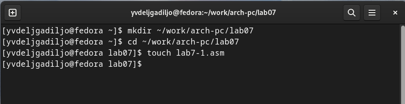{#fig:3.1 width=90%}

Инструкция jmp в NASM используется для реализации безусловных переходов.
Рассмотрим пример программы с использованием инструкции jmp. Введите в
файл lab7-1.asm текст программы из листинга 7.1.

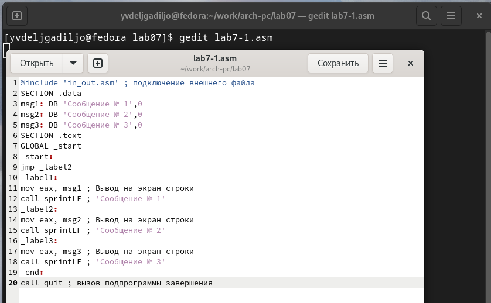{#fig:3.2 width=90%}

Создайте исполняемый файл и запустите его. Результат работы данной
программы будет следующим:

user@dk4n31:\~\$ ./lab7-1

Сообщение № 2

Сообщение № 3

user@dk4n31:\~\$

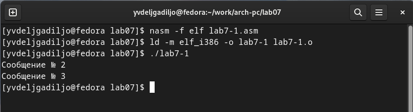{#fig:3.3 width=90%}

Таким образом, использование инструкции jmp \_label2 меняет порядок
исполнения

инструкций и позволяет выполнить инструкции начиная с метки \_label2,
пропустив вывод первого сообщения.

Инструкция jmp позволяет осуществлять переходы не только вперед но и
назад. Изменим программу таким образом, чтобы она выводила сначала
'Сообщение № 2', потом 'Сообщение № 1' и завершала работу. Для этого в
текст программы после вывода сообщения № 2 добавим инструкцию jmp с
меткой \_label1 (т.е. переход к инструкциям вывода сообщения № 1) и
после вывода сообщения № 1 добавим инструкцию jmp с меткой \_end (т.е.
переход к инструкции call quit). Измените текст программы в соответствии
с листингом 7.2

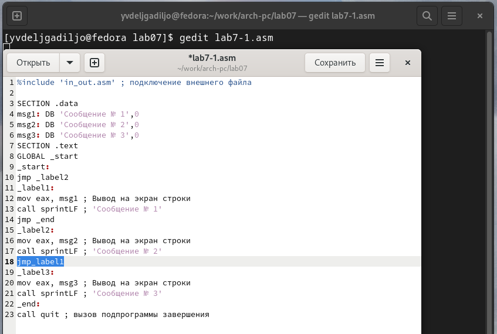{#fig:3.4 width=90%}

Создайте исполняемый файл и проверьте его работу.

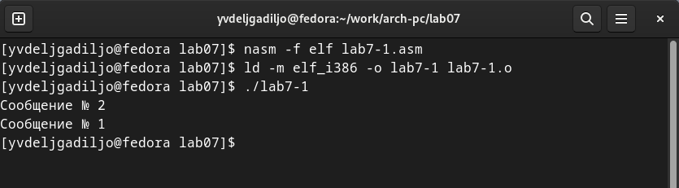{#fig:3.5 width=90%}

Измените текст программы добавив или изменив инструкции jmp, чтобы вывод
программы был следующим:

user@dk4n31:\~\$ ./lab7-1

Сообщение № 3

Сообщение № 2

Сообщение № 1

user@dk4n31:\~\$

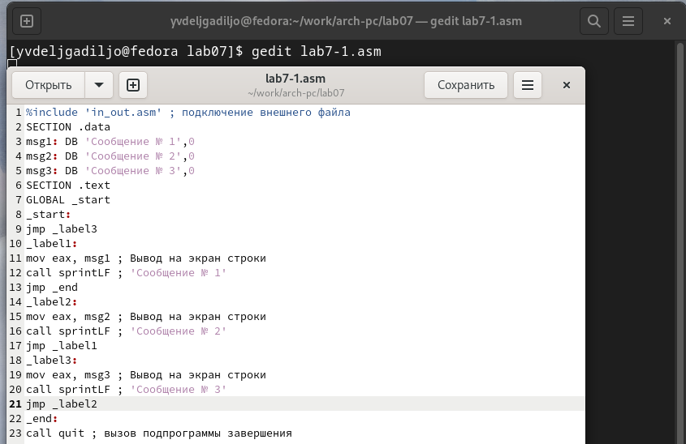{#fig:3.6 width=90%}

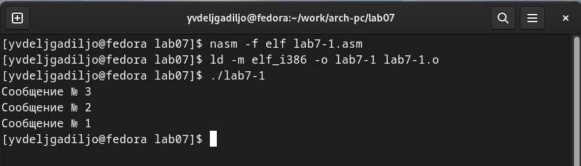{#fig:3.7 width=90%}

Использование инструкции jmp приводит к переходу в любом случае. Однако,
часто при написании программ необходимо использовать условные переходы,
т.е. переход должен происходить если выполнено какое-либо условие. В
качестве примера рассмотрим программу, которая определяет и выводит на
экран наибольшую из 3 целочисленных переменных: A,B и C. Значения для A
и C задаются в программе, значение B вводиться с клавиатуры.

Создайте файл lab7-2.asm в каталоге \~/work/arch-pc/lab07. Внимательно
изучите текст программы из листинга 7.3 и введите в lab7-2.asm.

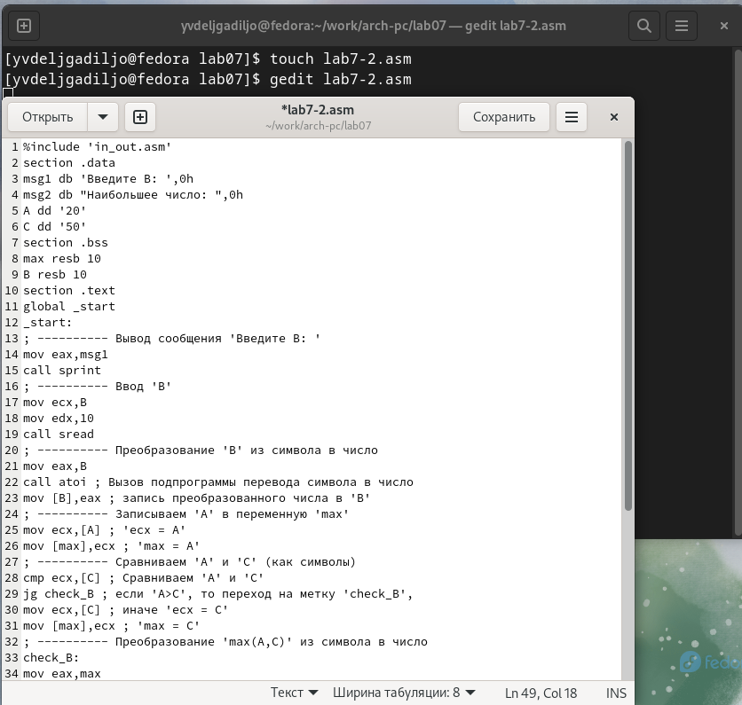{#fig:3.8 width=90%}

Создайте исполняемый файл и проверьте его работу для разных значений B.
Обратите внимание, в данном примере переменные A и С сравниваются как
символы, а переменная B и максимум из A и С как числа (для этого
используется функция atoi преобразования символа в число). Это сделано
для демонстрации того, как сравниваются данные.

Данную программу можно упростить и сравнивать все 3 переменные как
символы (т.е. не использовать функцию atoi). Однако если переменные
преобразовать из символов числа, над ними можно корректно проводить
арифметические операции.

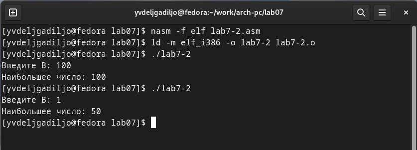{#fig:3.9 width=90%}

## Изучение структуры файлы листинга

Обычно nasm создаёт в результате ассемблирования только объектный файл.
Получить файл листинга можно, указав ключ -l и задав имя файла листинга
в командной строке.

Создайте файл листинга для программы из файла lab7-2.asm

nasm -f elf -l lab7-2.lst lab7-2.asm

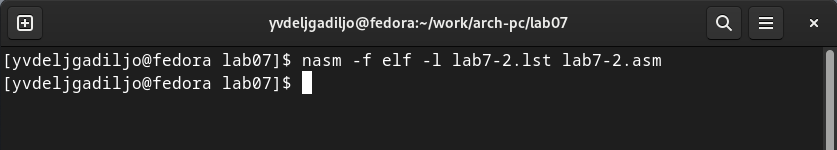{#fig:3.10 width=90%}

Откройте файл листинга lab7-2.lst с помощью любого текстового редактора,
например mcedit:

mcedit lab7-2.lst

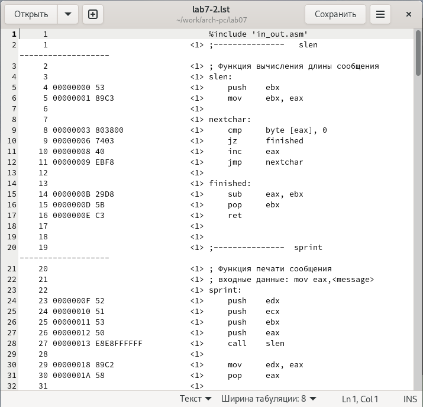{#fig:3.11 width=90%}

Внимательно ознакомиться с его форматом и содержимым. Подробно объяснить
содержимое трёх строк файла листинга по выбору.

в строке 9 содержится собственно номер сторки \[9\], адресс
\[00000003\], машинный код \[803800\] и содержимое строки кода \[cmp
byte \[eax\], 0\] в строке 11 содержится номер сторки \[11\], адресс
\[00000008\], машинный код \[40\] и содержимое строки кода \[inc eax\] в
строке 24 содержится номер сторки \[24\], адресс \[0000000F\], машинный
код \[52\] и содержимое строки кода \[push edx\].

Откройте файл с программой lab7-2.asm и в любой инструкции с двумя
операндами удалить один операнд.

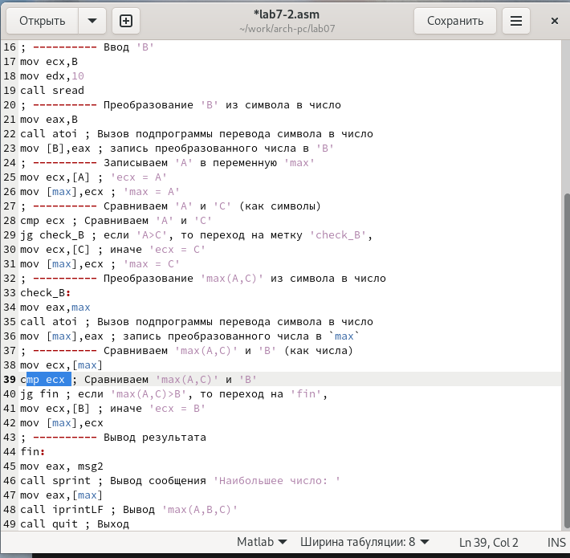{#fig:3.12 width=90%}

Выполните трансляцию с получением файла листинга:

nasm -f elf -l lab7-2.lst lab7-2.asm

Какие выходные файлы создаются в этом случае? Что добавляется в
листинге?

Oшибка в файле листинга

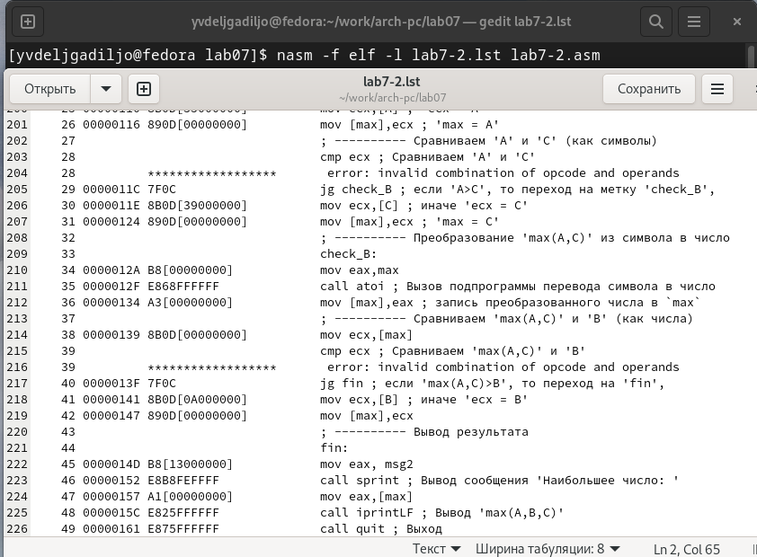{#fig:3.13 width=90%}

# Задание для самостоятельной работы

Напишите программу нахождения наименьшей из 3 целочисленных переменных
a,b и c. Значения переменных выбрать из табл. 7.5 в соответствии с
вариантом, полученным при выполнении лабораторной работы № 7 (Вар 19).
Создайте исполняемый файл и проверьте его
работу.

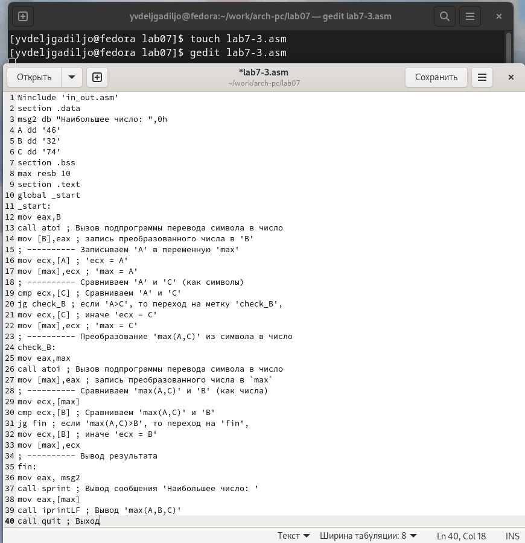{#fig:4.1 width=90%}

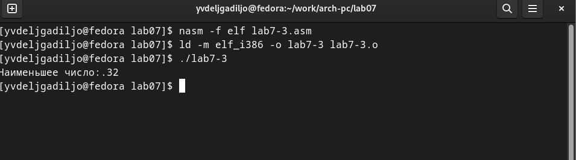{#fig:4.2 width=90%}

Напишите программу, которая для введенных с клавиатуры значений x и a
вычисляет

значение заданной функции f(x) и выводит результат вычислений. Вид
функции f(x)

выбрать из таблицы 7.6 вариантов заданий в соответствии с вариантом,
полученным

при выполнении лабораторной работы № 7. Создайте исполняемый файл и
проверьте

его работу для значений x и a из 7.6.Вар 19:

a + x, x \> a

x, x ≤ a Код программы

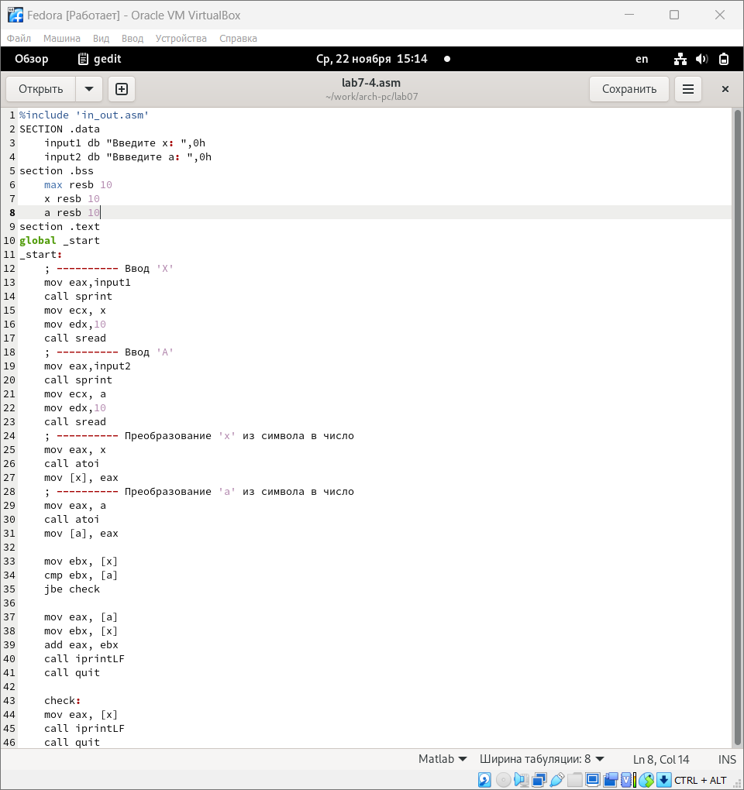{#fig:4.3 width=90%}

Результат выполнения
программы

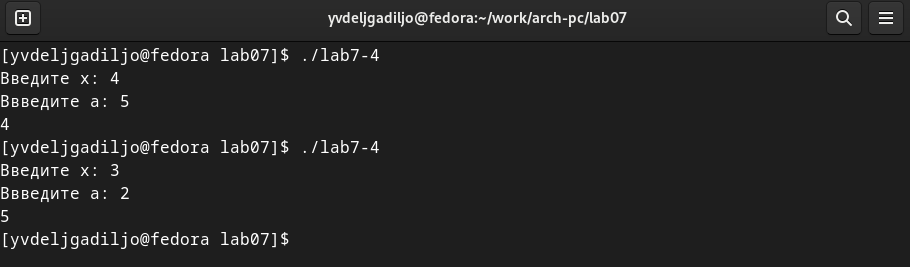{#fig:4.4 width=90%}

#  Выводы

Я изучила команды условного и безусловного переходов и научилась писать

программы с использованием этих переходов.

# Список литературы

-   GDB: The GNU Project Debugger. --- URL:
    https://www.gnu.org/software/gdb/.

-   GNU Bash Manual. --- 2016. --- URL:
    https://www.gnu.org/software/bash/manual/.

-   Midnight Commander Development Center. --- 2021. --- URL:
    https://midnight-commander.org/.

-   NASM Assembly Language Tutorials. --- 2021. --- URL:
    https://asmtutor.com/.

-   Newham C. Learning the bash Shell: Unix Shell Programming. ---
    O'Reilly Media, 2005. ---354 с. --- (In a Nutshell). ---
    ISBN 0596009658. --- URL:
    http://www.amazon.com/Learningbash-Shell-Programming-Nutshell/dp/0596009658.

-   Robbins A. Bash Pocket Reference. --- O'Reilly Media, 2016. --- 156
    с. --- ISBN 978-1491941591.

-   The NASM documentation. --- 2021. --- URL:
    https://www.nasm.us/docs.php.

-   Zarrelli G. Mastering Bash. --- Packt Publishing, 2017. --- 502 с.
    --- ISBN 9781784396879.

-   Колдаев В. Д., Лупин С. А. Архитектура ЭВМ. --- М. : Форум, 2018.

-   Куляс О. Л., Никитин К. А. Курс программирования на ASSEMBLER. ---
    М. : Солон-Пресс, 2017.

-   Новожилов О. П. Архитектура ЭВМ и систем. --- М. : Юрайт, 2016.

-   Расширенный ассемблер: NASM. --- 2021. --- URL:
    https://www.opennet.ru/docs/RUS/nasm/.

-   Робачевский А., Немнюгин С., Стесик О. Операционная система UNIX.
    --- 2-е изд. --- БХВПетербург, 2010. --- 656 с. --- ISBN
    978-5-94157-538-1.

-   Столяров А. Программирование на языке ассемблера NASM для ОС Unix.
    --- 2-е изд. --- М. : МАКС Пресс, 2011. --- URL:
    http://www.stolyarov.info/books/asm_unix.

-   Таненбаум Э. Архитектура компьютера. --- 6-е изд. --- СПб. :
    Питер, 2013. --- 874 с. --- (Классика Computer Science).

-   Таненбаум Э., Бос Х. Современные операционн
