---
## Front matter
title: "ОтчеТт по лабораторной работе №8"
subtitle: "дисциплина: Архитектура компьютера"
author: "Дельгадильо Валерия"

## Generic otions
lang: ru-RU
toc-title: "Содержание"

## Bibliography
bibliography: bib/cite.bib
csl: pandoc/csl/gost-r-7-0-5-2008-numeric.csl

## Pdf output format
toc: true # Table of contents
toc-depth: 2
lof: true # List of figures
lot: true # List of tables
fontsize: 12pt
linestretch: 1.5
papersize: a4
documentclass: scrreprt
## I18n polyglossia
polyglossia-lang:
  name: russian
  options:
	- spelling=modern
	- babelshorthands=true
polyglossia-otherlangs:
  name: english
## I18n babel
babel-lang: russian
babel-otherlangs: english
## Fonts
mainfont: PT Serif
romanfont: PT Serif
sansfont: PT Sans
monofont: PT Mono
mainfontoptions: Ligatures=TeX
romanfontoptions: Ligatures=TeX
sansfontoptions: Ligatures=TeX,Scale=MatchLowercase
monofontoptions: Scale=MatchLowercase,Scale=0.9
## Biblatex
biblatex: true
biblio-style: "gost-numeric"
biblatexoptions:
  - parentracker=true
  - backend=biber
  - hyperref=auto
  - language=auto
  - autolang=other*
  - citestyle=gost-numeric
## Pandoc-crossref LaTeX customization
figureTitle: "Рис."
tableTitle: "Таблица"
listingTitle: "Листинг"
lofTitle: "Список иллюстраций"
lotTitle: "Список таблиц"
lolTitle: "Листинги"
## Misc options
indent: true
header-includes:
  - \usepackage{indentfirst}
  - \usepackage{float} # keep figures where there are in the text
  - \floatplacement{figure}{H} # keep figures where there are in the text
---
# Цель работы 

Приобретение навыков написания программ с использованием циклов и
обработкой аргументов командной строки.

#  Теоретическое введение

## Организация стека

Стек --- это структура данных, организованная по принципу LIFO («Last In
--- First Out» или «последним пришёл --- первым ушёл»). Стек является
частью архитектуры процессора и реализован на аппаратном уровне. Для
работы со стеком в процессоре есть специальные регистры (ss, bp, sp) и
команды.

Основной функцией стека является функция сохранения адресов возврата и
передачи аргументов при вызове процедур. Кроме того, в нём выделяется
память для локальных переменных и могут временно храниться значения
регистров.

Стек имеет вершину, адрес последнего добавленного элемента, который
хранится в регистре esp (указатель стека). Противоположный конец стека
называется дном. Значение, помещённое в стек последним, извлекается
первым. При помещении значения в стек указатель стека уменьшается, а при
извлечении --- увеличивается.

Для стека существует две основные операции:

• добавление элемента в вершину стека (push);

• извлечение элемента из вершины стека (pop).

## Инструкции организации циклов

Для организации циклов существуют специальные инструкции. Для всех
инструкций максимальное количество проходов задаётся в регистре ecx.
Наиболее простой является инструкция loop. Она позволяет организовать
безусловный цикл, типичная структура.

Иструкция loop выполняется в два этапа. Сначала из регистра ecx
вычитается единица и его значение сравнивается с нулём. Если регистр не
равен нулю, то выполняется переход к указанной метке. Иначе переход не
выполняется и управление передаётся команде, которая следует сразу после
команды loop.

# Лабораторной работы 

## Реализация циклов в NASM

Создайте каталог для программам лабораторной работы № 8, перейдите в
него и создайте файл lab8-1.asm:

mkdir \~/work/arch-pc/lab08

cd \~/work/arch-pc/lab08

touch lab8-1.asm

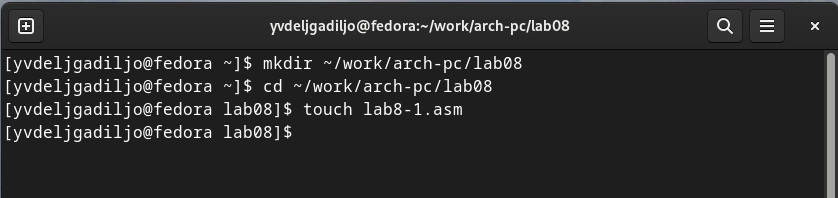{#fig:3.1 width=90%}

При реализации циклов в NASM с использованием инструкции loop необходимо
помнить о том, что эта инструкция использует регистр ecx в качестве
счетчика и на каждом шаге уменьшает его значение на единицу. В качестве
примера рассмотрим программу, которая выводит значение регистра ecx.
Внимательно изучите текст программы (Листинг 8.1).Введите в файл
lab8-1.asm текст программы из листинга 8.1. Создайте исполняемый файл и
проверьте его работу.

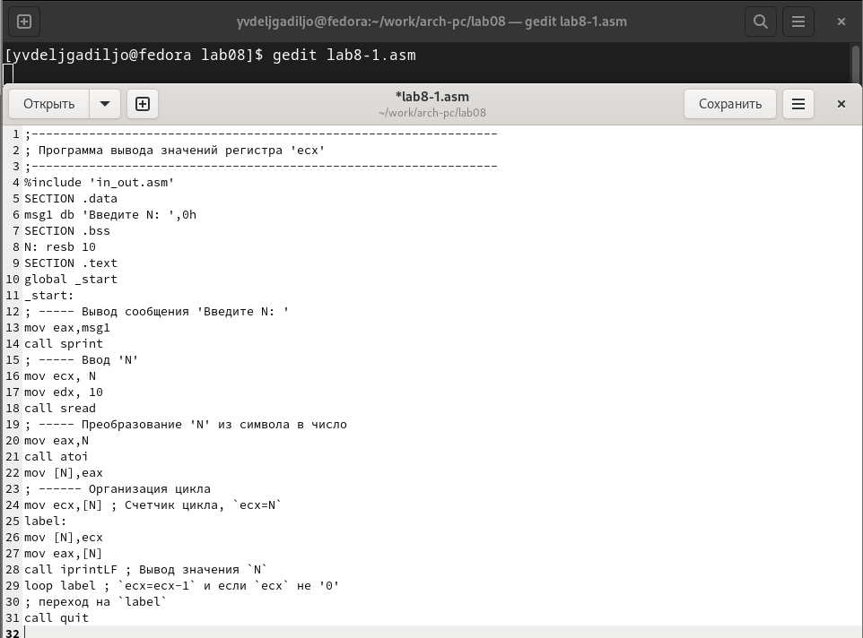{#fig:3.2 width=90%}

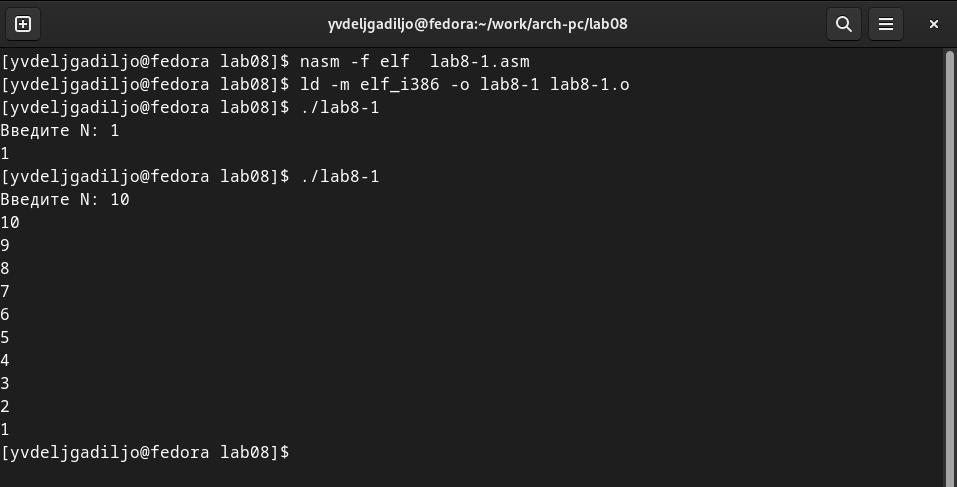{#fig:3.3 width=90%}

Данный пример показывает, что использование регистра ecx в теле цилка
loop может
привести к некорректной работе программы. Измените текст программы
добавив изменение значение регистра ecx в цикле:label:

sub ecx,1 ; \`ecx=ecx-1\`

mov \[N\],ecx

mov eax,\[N\]

call iprintLFloop
label

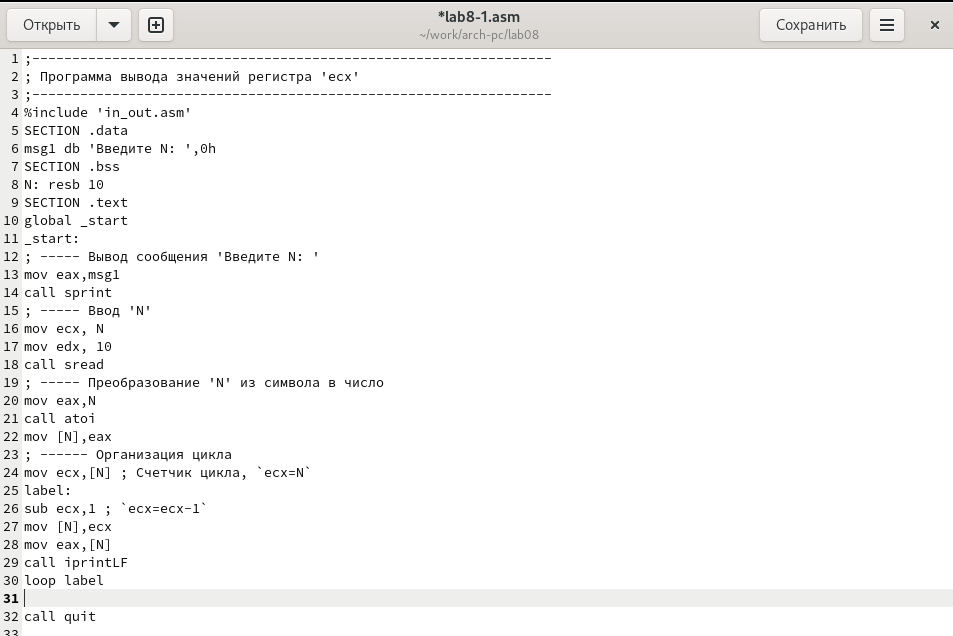{#fig:3.4 width=90%}

Создайте исполняемый файл и проверьте его работу.

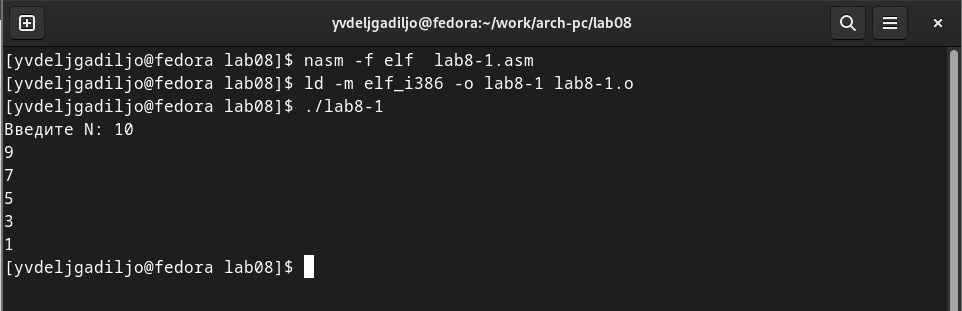{#fig:3.5 width=90%}

Какие значения принимает регистр ecx в цикле? Соответствует ли число
проходов цикла значению N введенному с клавиатуры?

Нет, в данном случае N равно 10, а число проходов цикла равно 5.

Внесите изменения в текст программы добавив команды push и pop
(добавления в стек и извлечения из стека) для сохранения значения
счетчика цикла loop:

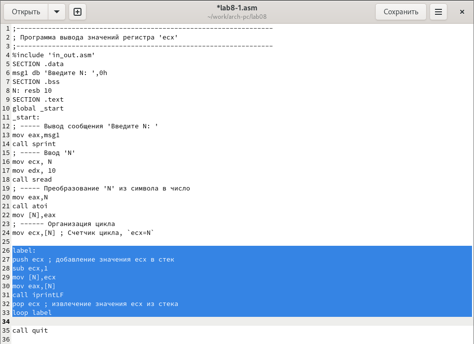{#fig:3.6 width=90%}

Создайте исполняемый файл и проверьте его работу.

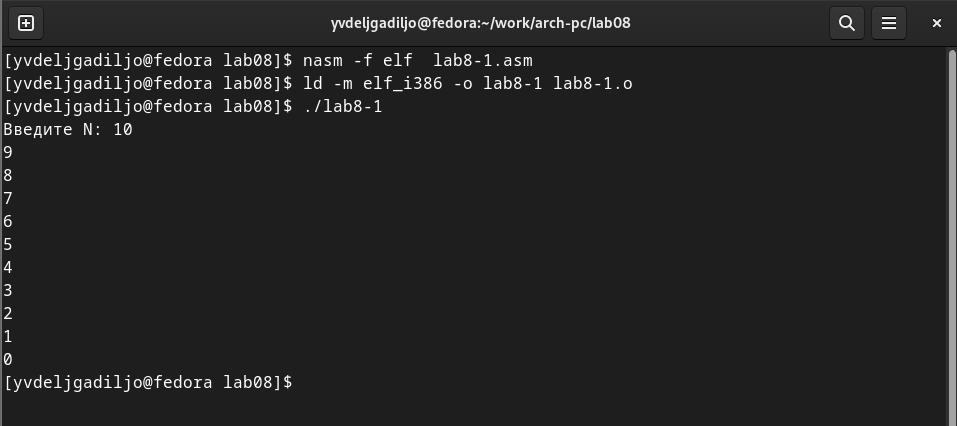{#fig:3.7 width=90%}

Соответствует ли в данном случае число проходов цикла значению N
введенному с клавиатуры? Да.

## Обработка аргументов командной строки

Создайте файл lab8-2.asm в каталоге \~/work/arch-pc/lab08

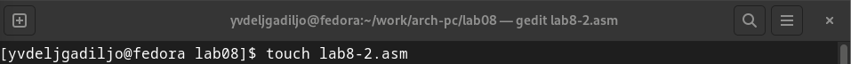{#fig:3.8 width=90%}

Bведите в него текст программы из листинга 8.2.

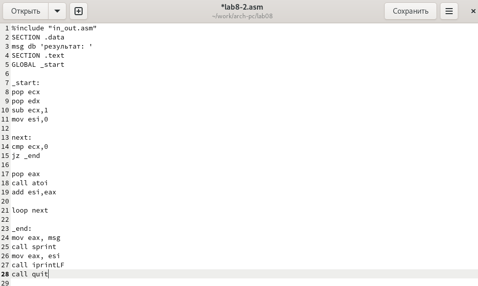{#fig:3.9 width=90%}

Создайте исполняемый файл и запустите его, указав аргументы:

user@dk4n31:\~\$ ./lab8-2 аргумент1 аргумент 2 \'аргумент 3\'

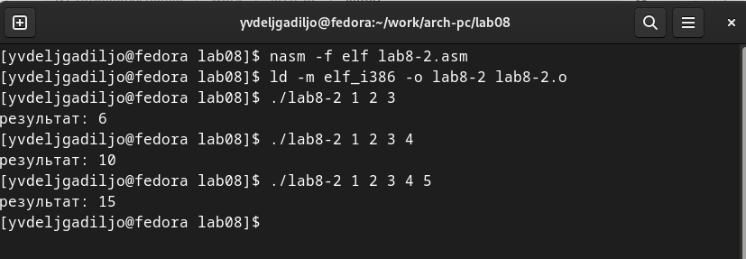{#fig:3.10 width=90%}

Создайте файл lab8-3.asm в каталоге \~/work/archpc/lab08 и введите в
него текст программы из листинга 8.3.

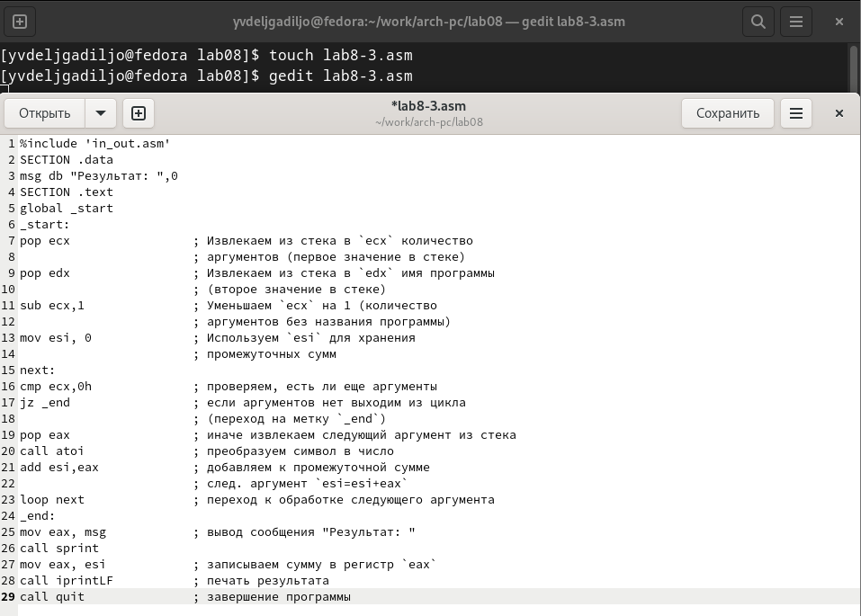{#fig:3.11 width=90%}

Создайте исполняемый файл и запустите его, указав аргументы. Пример
результата работы программы:

user@dk4n31:\~\$ ./main 12 13 7 10 5

Результат: 47

user@dk4n31:\~\$

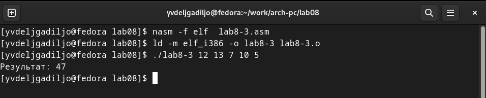{#fig:3.12 width=90%}

Измените текст программы из листинга 8.3 для вычисления произведения
аргументов командной
строки.

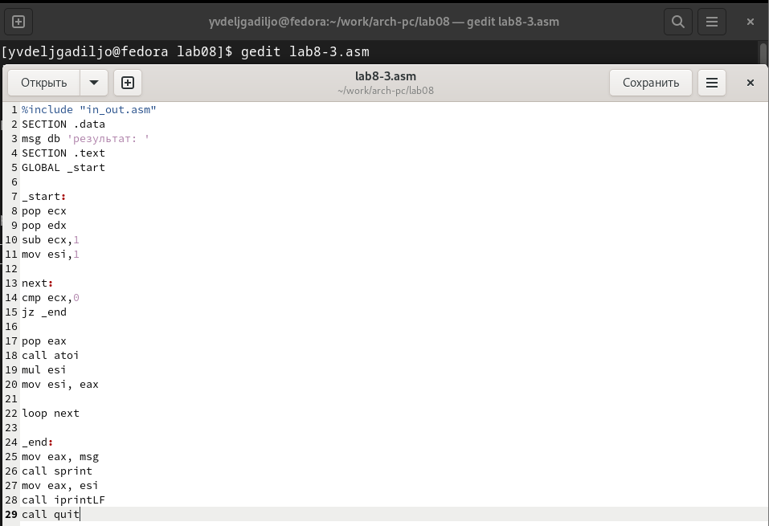{#fig:3.13 width=90%}

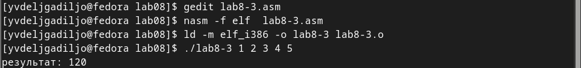{#fig:3.14 width=90%}

# Задание для самостоятельной работы

Номер варианта: 19

F(x) = 8x-3

Напишите программу, которая находит сумму значений функции f(X).
Значения xi передаются как аргументы. Создайте исполняемый файл и
проверьте его работу на нескольких наборах.

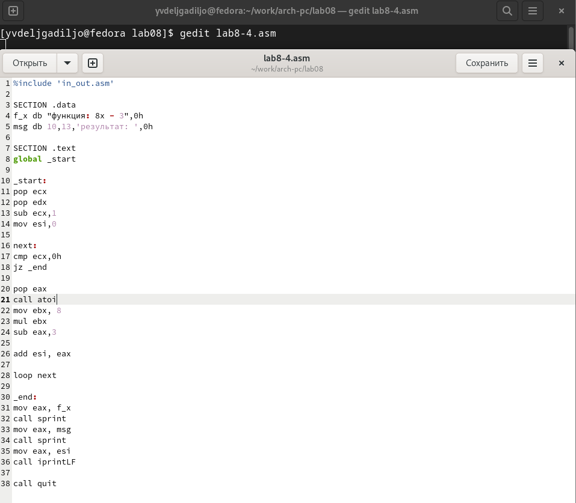{#fig:4.1 width=90%}

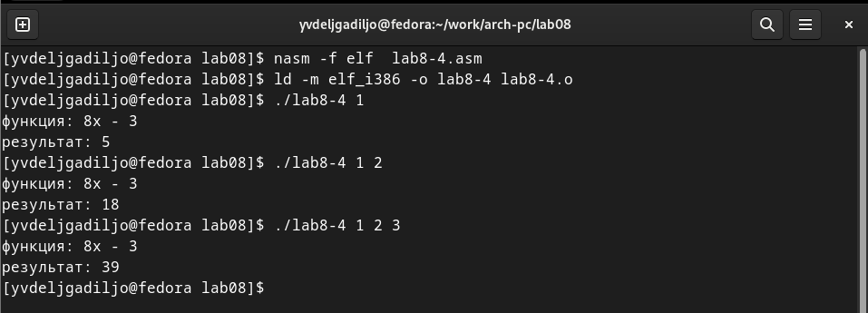{#fig:4.2 width=90%}

#  Выводы

Были получены по организации циклов и работе со стеком на языке NASM.

# Список литературы

-   GDB: The GNU Project Debugger. --- URL:
    https://www.gnu.org/software/gdb/.

-   GNU Bash Manual. --- 2016. --- URL:
    https://www.gnu.org/software/bash/manual/.

-   Midnight Commander Development Center. --- 2021. --- URL:
    https://midnight-commander.org/.

-   NASM Assembly Language Tutorials. --- 2021. --- URL:
    https://asmtutor.com/.

-   Newham C. Learning the bash Shell: Unix Shell Programming. ---
    O'Reilly Media, 2005. ---354 с. --- (In a Nutshell). ---
    ISBN 0596009658. --- URL:
    http://www.amazon.com/Learningbash-Shell-Programming-Nutshell/dp/0596009658.

-   Robbins A. Bash Pocket Reference. --- O'Reilly Media, 2016. --- 156
    с. --- ISBN 978-1491941591.

-   The NASM documentation. --- 2021. --- URL:
    https://www.nasm.us/docs.php.

-   Zarrelli G. Mastering Bash. --- Packt Publishing, 2017. --- 502 с.
    --- ISBN 9781784396879.

-   Колдаев В. Д., Лупин С. А. Архитектура ЭВМ. --- М. : Форум, 2018.

-   Куляс О. Л., Никитин К. А. Курс программирования на ASSEMBLER. ---
    М. : Солон-Пресс, 2017.

-   Новожилов О. П. Архитектура ЭВМ и систем. --- М. : Юрайт, 2016.

-   Расширенный ассемблер: NASM. --- 2021. --- URL:
    https://www.opennet.ru/docs/RUS/nasm/.

-   Робачевский А., Немнюгин С., Стесик О. Операционная система UNIX.
    --- 2-е изд. --- БХВПетербург, 2010. --- 656 с. --- ISBN
    978-5-94157-538-1.

-   Столяров А. Программирование на языке ассемблера NASM для ОС Unix.
    --- 2-е изд. --- М. : МАКС Пресс, 2011. --- URL:
    http://www.stolyarov.info/books/asm_unix.

-   Таненбаум Э. Архитектура компьютера. --- 6-е изд. --- СПб. :
    Питер, 2013. --- 874 с. --- (Классика Computer Science).

-   Таненбаум Э., Бос Х. Современные операционн
