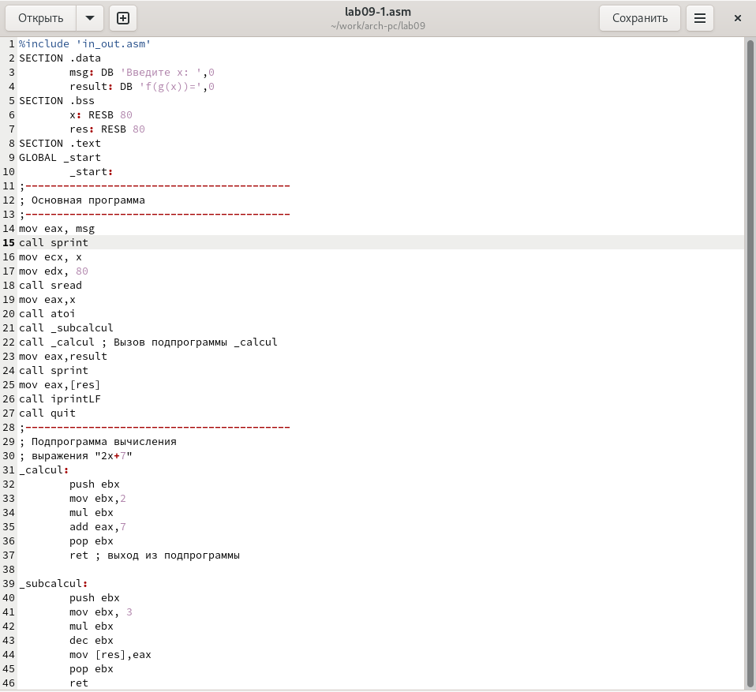

---
## Front matter
title: "ОтчеТт по лабораторной работе №9"
subtitle: "дисциплина: Архитектура компьютера"
author: "Дельгадильо Валерия"

## Generic otions
lang: ru-RU
toc-title: "Содержание"

## Bibliography
bibliography: bib/cite.bib
csl: pandoc/csl/gost-r-7-0-5-2008-numeric.csl

## Pdf output format
toc: true # Table of contents
toc-depth: 2
lof: true # List of figures
lot: true # List of tables
fontsize: 12pt
linestretch: 1.5
papersize: a4
documentclass: scrreprt
## I18n polyglossia
polyglossia-lang:
  name: russian
  options:
	- spelling=modern
	- babelshorthands=true
polyglossia-otherlangs:
  name: english
## I18n babel
babel-lang: russian
babel-otherlangs: english
## Fonts
mainfont: PT Serif
romanfont: PT Serif
sansfont: PT Sans
monofont: PT Mono
mainfontoptions: Ligatures=TeX
romanfontoptions: Ligatures=TeX
sansfontoptions: Ligatures=TeX,Scale=MatchLowercase
monofontoptions: Scale=MatchLowercase,Scale=0.9
## Biblatex
biblatex: true
biblio-style: "gost-numeric"
biblatexoptions:
  - parentracker=true
  - backend=biber
  - hyperref=auto
  - language=auto
  - autolang=other*
  - citestyle=gost-numeric
## Pandoc-crossref LaTeX customization
figureTitle: "Рис."
tableTitle: "Таблица"
listingTitle: "Листинг"
lofTitle: "Список иллюстраций"
lotTitle: "Список таблиц"
lolTitle: "Листинги"
## Misc options
indent: true
header-includes:
  - \usepackage{indentfirst}
  - \usepackage{float} # keep figures where there are in the text
  - \floatplacement{figure}{H} # keep figures where there are in the text
---

# Цель работы

Приобретение навыков написания программ с использованием подпрограмм.
Знакомство с методами отладки при помощи GDB и его основными
возможностями.

#  Теоретическое введение

## Понятие об отладке

Отладка --- это процесс поиска и исправления ошибок в программе. В общем
случае его можно разделить на четыре этапа:

• обнаружение ошибки;

• поиск её местонахождения;

• определение причины ошибки;

• исправление ошибки.

Можно выделить следующие типы ошибок:

• синтаксические ошибки --- обнаруживаются во время трансляции исходного
кода и вызваны нарушением ожидаемой формы или структуры языка;

• семантические ошибки --- являются логическими и приводят к тому, что
программа запускается, отрабатывает, но не даёт желаемого результата;

• ошибки в процессе выполнения --- не обнаруживаются при трансляции и
вызывают прерывание выполнения программы (например, это ошибки,
связанные с переполнением или делением на ноль).

Второй этап --- поиск местонахождения ошибки. Некоторые ошибки
обнаружить довольно трудно. Лучший способ найти место в программе, где
находится ошибка, это разбить программу на части и произвести их отладку
отдельно друг от друга.

Третий этап --- выяснение причины ошибки. После определения
местонахождения ошибки обычно проще определить причину неправильной
работы программы.

Последний этап --- исправление ошибки. После этого при повторном запуске
программы, может обнаружиться следующая ошибка, и процесс отладки
начнётся заново.

## Методы отладки

Наиболее часто применяют следующие методы отладки:

• создание точек контроля значений на входе и выходе участка программы
(например, вывод промежуточных значений на экран --- так называемые
диагностические сообщения);

• использование специальных программ-отладчиков.

Отладчики позволяют управлять ходом выполнения программы, контролировать
и изменять данные. Это помогает быстрее найти место ошибки в программе и
ускорить её исправление. Наиболее популярные способы работы с отладчиком
--- это использование точек останова и выполнение программы по шагам.

Пошаговое выполнение --- это выполнение программы с остановкой после
каждой строчки, чтобы программист мог проверить значения переменных и
выполнить другие действия.

Точки останова --- это специально отмеченные места в программе, в
которых программаотладчик приостанавливает выполнение программы и ждёт
команд. Наиболее популярные виды точек останова:

• Breakpoint --- точка останова (остановка происходит, когда выполнение
доходит до

определённой строки, адреса или процедуры, отмеченной программистом);

• Watchpoint --- точка просмотра (выполнение программы
приостанавливается, если программа обратилась к определённой переменной: 
либо считала её значение, либо изменила его).

Точки останова устанавливаются в отладчике на время сеанса работы с
кодом программы, т.е. они сохраняются до выхода из программы-отладчика
или до смены отлаживаемой программы.

# Лабораторной работы 

## Реализация подпрограмм в NASM

Создайте каталог для выполнения лабораторной работы № 9, перейдите в
него и создайте файл lab09-1.asm:

mkdir \~/work/arch-pc/lab09

cd \~/work/arch-pc/lab09

touch lab09-1.asm

{#fig:3.1 width=90%}

В качестве примера рассмотрим программу вычисления арифметического
выражения f(x) = 2x + 7 с помощью подпрограммы \_calcul. В данном
примере x вводится с клавиатуры, а само выражение вычисляется в
подпрограмме. Внимательно изучите текст программы (Листинг 9.1)

{#fig:3.2 width=90%}

Создайте исполняемый файл и проверьте его работу.

{#fig:3.3 width=90%}

Измените текст программы, добавив подпрограмму \_subcalcul в
подпрограмму \_calcul, для вычисления выражения f(g(x)), где x вводится
с клавиатуры, f(x) = 2x + 7, g(x) =3x − 1.

{#fig:3.4 width=90%}

Создайте исполняемый файл и проверьте его работу.

{#fig:3.5 width=90%}

## Отладка программам с помощью GDB

Создайте файл lab09-2.asm с текстом программы из Листинга 9.2.
(Программа печати сообщения Hello world!):

{#fig:3.6 width=90%}

Получите исполняемый файл.Для работы с GDB в исполняемый файл необходимо
добавить отладочную информацию, для этого трансляцию программ необходимо
проводить с ключом '-g'.

nasm -f elf -g -l lab09-2.lst lab09-2.asm

ld -m elf_i386 -o lab09-2 lab09-2.o

{#fig:3.7 width=90%}

Загрузите исполняемый файл в отладчик gdb:

user@dk4n31:\~\$ gdb lab09-2

{#fig:3.8 width=90%}

Проверьте работу программы, запустив ее в оболочке GDB с помощью команды
run (сокращённо r):

(gdb) run

Starting program: \~/work/arch-pc/lab09/lab09-2

Hello, world!

\[Inferior 1 (process 10220) exited normally\]

(gdb)

{#fig:3.9 width=90%}

Для более подробного анализа программы установите брейкпоинт на метку
\_start, с которой начинается выполнение любой ассемблерной программы, 
и запустите её.

{#fig:3.10 width=90%}

Посмотрите дисассимилированный код программы с помощью команды
disassemble

начиная с метки \_start

(gdb) disassemble \_start

{#fig:3.11 width=90%}

Переключитесь на отображение команд с Intel'овским синтаксисом, введя
команду set

disassembly-flavor intel

(gdb) set disassembly-flavor intel

(gdb) disassemble \_start

{#fig:3.12 width=90%}

Перечислите различия отображения синтаксиса машинных команд в режимах
ATT и Intel.

Включите режим псевдографики для более удобного анализа программы:

(gdb) layout asm

(gdb) layout regs

{#fig:3.13 width=90%}

## Добавление точек останова

Установить точку останова можно командой break (кратко b). Типичный
аргумент этой команды --- место установки. Его можно задать или как
номер строки программы (имеет смысл, если есть исходный файл, а
программа компилировалась с информацией об отладке), или как имя метки,
или как адрес. Чтобы не было путаницы с номерами, перед адресом ставится
«звёздочка»: На предыдущих шагах была установлена точка останова по
имени метки (\_start). Проверьте это с помощью команды info breakpoints
(кратко i b):(gdb) info breakpoints

{#fig:3.14 width=90%}

Установим еще одну точку останова по адресу инструкции. Адрес инструкции
можно увидеть в средней части экрана в левом столбце соответствующей
инструкции.

Определите адрес предпоследней инструкции (mov ebx,0x0) и установите
точку останова.

(gdb) break \*\<адрес\>

{#fig:3.15 width=90%}

Посмотрите информацию о всех установленных точках останова:

(gdb) i b

{#fig:3.16 width=90%}

## Работа с данными программы в GDB

Посмотреть содержимое регистров также можно с помощью команды info
registers (или i r).

(gdb) info registers

{#fig:3.17 width=90%}

Для отображения содержимого памяти можно использовать команду x
\<адрес\>, которая выдаёт содержимое ячейки памяти по указанному адресу.
Формат, в котором выводятся данные, можно задать после имени команды
через косую черту: x/NFU \<адрес\>.

С помощью команды x &\<имя переменной\> также можно посмотреть
содержимое переменной.

Посмотрите значение переменной msg1 по имени

(gdb) x/1sb &msg1

0x804a000 \<msg1\>: \"Hello,\"

{#fig:3.18 width=90%}

Посмотрите значение переменной msg2 по адресу. Адрес переменной можно
определить по дизассемблированной инструкции. Посмотрите инструкцию mov
ecx,msg2 которая записывает в регистр ecx адрес перемененной
msg2.

{#fig:3.19 width=90%}

Изменить значение для регистра или ячейки памяти можно с помощью команды
set,

задав ей в качестве аргумента имя регистра или адрес. При этом перед
именем регистра ставится префикс \$, а перед адресом нужно указать в
фигурных скобках тип данных (размер сохраняемого значения; в качестве
типа данных можно использовать типы языка Си).

Измените первый символ переменной msg1:

(gdb) set {char}msg1=\'h\'

(gdb) x/1sb &msg1

0x804a000 \<msg1\>: \"hello, \"

(gdb)

{#fig:3.20 width=90%}

Замените любой символ во второй переменной msg2.

{#fig:3.21 width=90%}

Чтобы посмотреть значения регистров используется команда print /F
\<val\> (перед именем регистра обязательно ставится префикс \$):

p/F 

\$\<регистр\>

{#fig:3.22 width=90%}

Выведете в различных форматах (в шестнадцатеричном формате, в двоичном
формате и в символьном виде) значение регистра edx.

С помощью команды set измените значение регистра ebx:

{#fig:3.23 width=90%}

Завершим работу в gdb командами continue, она закончит выполнение
программы, и exit, она завершит сеанс gdb.

1.4.3. Обработка аргументов командной строки в GDBСкопируйте файл
lab8-2.asm, созданный при выполнении лабораторной работы №8,

с программой выводящей на экран аргументы командной строки (Листинг 8.2)
в файл с именем lab09-3.asm:

cp \~/work/arch-pc/lab08/lab8-2.asm
\~/work/arch-pc/lab09/lab09-3.asm

{#fig:3.24 width=90%}

Создайте исполняемый файл.

nasm -f elf -g -l lab09-3.lst lab09-3.asm

ld -m elf_i386 -o lab09-3 lab09-3.o

{#fig:3.25 width=90%}

Для загрузки в gdb программы с аргументами необходимо использовать ключ
\--args.

Загрузите исполняемый файл в отладчик, указав аргументы:

gdb \--args lab09-3 аргумент1 аргумент 2 \'аргумент 3\'

{#fig:3.26 width=90%}

Для начала установим точку останова перед первой инструкцией в программе
и запустим ее.

(gdb) b \_start

(gdb) run

{#fig:3.27 width=90%}

Адрес вершины стека храниться в регистре esp и по этому адресу
располагается число равное количеству аргументов командной строки
(включая имя программы):

(gdb) x/x \$esp

0xffffd200: 0x05

{#fig:3.28 width=90%}

Как видно, число аргументов равно 5 -- это имя программы lab09-3 и
непосредственно аргументы: аргумент1, аргумент, 2 и \'аргумент 3\'.

Посмотрите остальные позиции стека -- по адесу \[esp+4\] располагается
адрес в памяти где находиться имя программы, по адесу \[esp+8\]
храниться адрес первого аргумента, по аресу \[esp+12\] -- второго и
т.д.

{#fig:3.29 width=90%}

Объясните, почему шаг изменения адреса равен 4 (\[esp+4\], \[esp+8\],
\[esp+12\] и т.д.).

Их адреса распологаются в 4 байтах друг от друга (именно столько
заниемает элемент стека).

# Задание для самостоятельной работы

Преобразуйте программу из лабораторной работы N8 (Задание N1 для
самостоятельной работы), реализовав вычисление значения функции f(x) как
подпрограмму.

{#fig:4.1 width=90%}

И проверка ее работоспособности

{#fig:4.2 width=90%}

В листинге 9.3 приведена программа вычисления выражения (3 + 2) ∗ 4 + 5.
При запуске данная программа дает неверный результат. Проверьте это. С
помощью отладчика GDB, анализируя изменения значений регистров,
определите ошибку и исправьте ее.

{#fig:4.3 width=90%}

{#fig:4.4 width=90%}

{#fig:4.5 width=90%}

Просмотр регистров, для поиска ошибки в программе из листинга 10.3

{#fig:4.6 width=90%}

{#fig:4.7 width=90%}

Ошибка была в строках

{#fig:4.8 width=90%}

Правильно работающая программа представлена

{#fig:4.9 width=90%}

Проверка корректронсти работы программы, после исправлений

{#fig:4.10 width=90%}

#  Выводы

В результате выполнения работы, я научился организовывать код в
подпрограммы и познакомился с базовыми функциями отладчика gdb.

# Список литературы

-   GDB: The GNU Project Debugger. --- URL:
    https://www.gnu.org/software/gdb/.

-   GNU Bash Manual. --- 2016. --- URL:
    https://www.gnu.org/software/bash/manual/.

-   Midnight Commander Development Center. --- 2021. --- URL:
    https://midnight-commander.org/.

-   NASM Assembly Language Tutorials. --- 2021. --- URL:
    https://asmtutor.com/.

-   Newham C. Learning the bash Shell: Unix Shell Programming. ---
    O'Reilly Media, 2005. ---354 с. --- (In a Nutshell). ---
    ISBN 0596009658. --- URL:
    http://www.amazon.com/Learningbash-Shell-Programming-Nutshell/dp/0596009658.

-   Robbins A. Bash Pocket Reference. --- O'Reilly Media, 2016. --- 156
    с. --- ISBN 978-1491941591.

-   The NASM documentation. --- 2021. --- URL:
    https://www.nasm.us/docs.php.

-   Zarrelli G. Mastering Bash. --- Packt Publishing, 2017. --- 502 с.
    --- ISBN 9781784396879.

-   Колдаев В. Д., Лупин С. А. Архитектура ЭВМ. --- М. : Форум, 2018.

-   Куляс О. Л., Никитин К. А. Курс программирования на ASSEMBLER. ---
    М. : Солон-Пресс, 2017.

-   Новожилов О. П. Архитектура ЭВМ и систем. --- М. : Юрайт, 2016.

-   Расширенный ассемблер: NASM. --- 2021. --- URL:
    https://www.opennet.ru/docs/RUS/nasm/.

-   Робачевский А., Немнюгин С., Стесик О. Операционная система UNIX.
    --- 2-е изд. --- БХВПетербург, 2010. --- 656 с. --- ISBN
    978-5-94157-538-1.

-   Столяров А. Программирование на языке ассемблера NASM для ОС Unix.
    --- 2-е изд. --- М. : МАКС Пресс, 2011. --- URL:
    http://www.stolyarov.info/books/asm_unix.

-   Таненбаум Э. Архитектура компьютера. --- 6-е изд. --- СПб. :
    Питер, 2013. --- 874 с. --- (Классика Computer Science).

-   Таненбаум Э., Бос Х. Современные операционн
